# AccessFlow Project Overview

This document is the single detailed source of truth for AccessFlow architecture, workflows, RBAC, database design, API surface, responsive strategy, deployment, versioning, and runtime recovery. The concise onboarding document remains [README.md](README.md).

<details>
<summary>Table of contents</summary>

- [A. System Architecture](#a-system-architecture)
- [B. Complete Flow Diagrams](#b-complete-flow-diagrams)
- [C. File And Folder Structure](#c-file-and-folder-structure)
- [D. Frontend Architecture](#d-frontend-architecture)
- [E. Backend Architecture](#e-backend-architecture)
- [F. Database Design](#f-database-design)
- [G. RBAC Matrix](#g-rbac-matrix)
- [H. API Documentation](#h-api-documentation)
- [I. Responsive Strategy](#i-responsive-strategy)
- [J. Deployment And Versioning](#j-deployment-and-versioning)

</details>

## A. System Architecture

AccessFlow is a static multi-entry frontend backed by a layered Spring Boot API. The browser loads a public auth shell or role-specific portal, restores the local session, checks runtime version state, and calls protected API endpoints with JWT access tokens. The backend validates tokens, roles, account state, organization scope, and lifecycle rules before reading or mutating MongoDB documents.

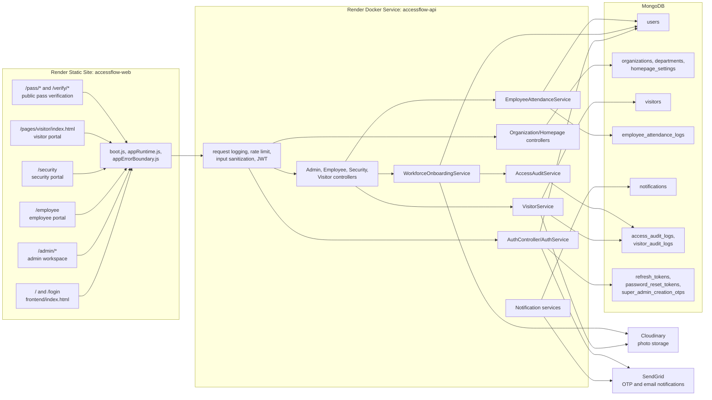
```mermaid
flowchart LR
    subgraph FE["Render Static Site: accessflow-web"]
        Login["/ and /login<br/>frontend/index.html"]
        Admin["/admin/*<br/>admin workspace"]
        Employee["/employee<br/>employee portal"]
        Security["/security<br/>security portal"]
        Visitor["/pages/visitor/index.html<br/>visitor portal"]
        Pass["/pass/* and /verify/*<br/>public pass verification"]
        Runtime["boot.js, appRuntime.js,<br/>appErrorBoundary.js"]
    end

    subgraph API["Render Docker Service: accessflow-api"]
        Filters["request logging, rate limit,<br/>input sanitization, JWT"]
        Auth["AuthController/AuthService"]
        Portal["Admin, Employee, Security,<br/>Visitor controllers"]
        Org["Organization/Homepage controllers"]
        VisitorSvc["VisitorService"]
        Workforce["WorkforceOnboardingService"]
        Attendance["EmployeeAttendanceService"]
        Notify["Notification services"]
        Audit["AccessAuditService"]
    end

    subgraph DB["MongoDB"]
        Users["users"]
        Orgs["organizations, departments,<br/>homepage_settings"]
        Visitors["visitors"]
        AttendanceLogs["employee_attendance_logs"]
        Notifications["notifications"]
        AuditLogs["access_audit_logs,<br/>visitor_audit_logs"]
        Tokens["refresh_tokens,<br/>password_reset_tokens,<br/>super_admin_creation_otps"]
    end

    Cloudinary["Cloudinary<br/>photo storage"]
    SendGrid["SendGrid<br/>OTP and email notifications"]

    Login --> Runtime
    Admin --> Runtime
    Employee --> Runtime
    Security --> Runtime
    Visitor --> Runtime
    Pass --> Runtime
    Runtime --> Filters
    Filters --> Auth
    Filters --> Portal
    Filters --> Org
    Portal --> VisitorSvc
    Portal --> Workforce
    Portal --> Attendance
    Auth --> Users
    Auth --> Tokens
    Org --> Orgs
    VisitorSvc --> Visitors
    VisitorSvc --> AuditLogs
    Workforce --> Users
    Workforce --> Audit
    Attendance --> Users
    Attendance --> AttendanceLogs
    Notify --> Notifications
    Audit --> AuditLogs
    VisitorSvc --> Cloudinary
    Workforce --> Cloudinary
    Notify --> SendGrid
    Auth --> SendGrid
```

### Frontend And Backend Interaction

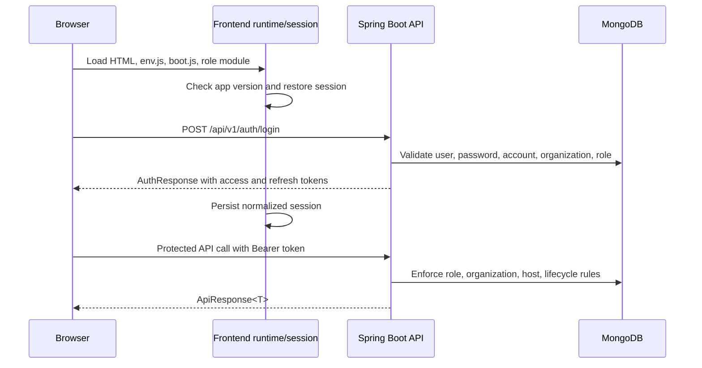
```mermaid
sequenceDiagram
    participant Browser
    participant Runtime as Frontend runtime/session
    participant API as Spring Boot API
    participant Mongo as MongoDB

    Browser->>Runtime: Load HTML, env.js, boot.js, role module
    Runtime->>Runtime: Check app version and restore session
    Browser->>API: POST /api/v1/auth/login
    API->>Mongo: Validate user, password, account, organization, role
    API-->>Browser: AuthResponse with access and refresh tokens
    Runtime->>Runtime: Persist normalized session
    Browser->>API: Protected API call with Bearer token
    API->>Mongo: Enforce role, organization, host, lifecycle rules
    API-->>Browser: ApiResponse<T>
```

### Deployment Architecture

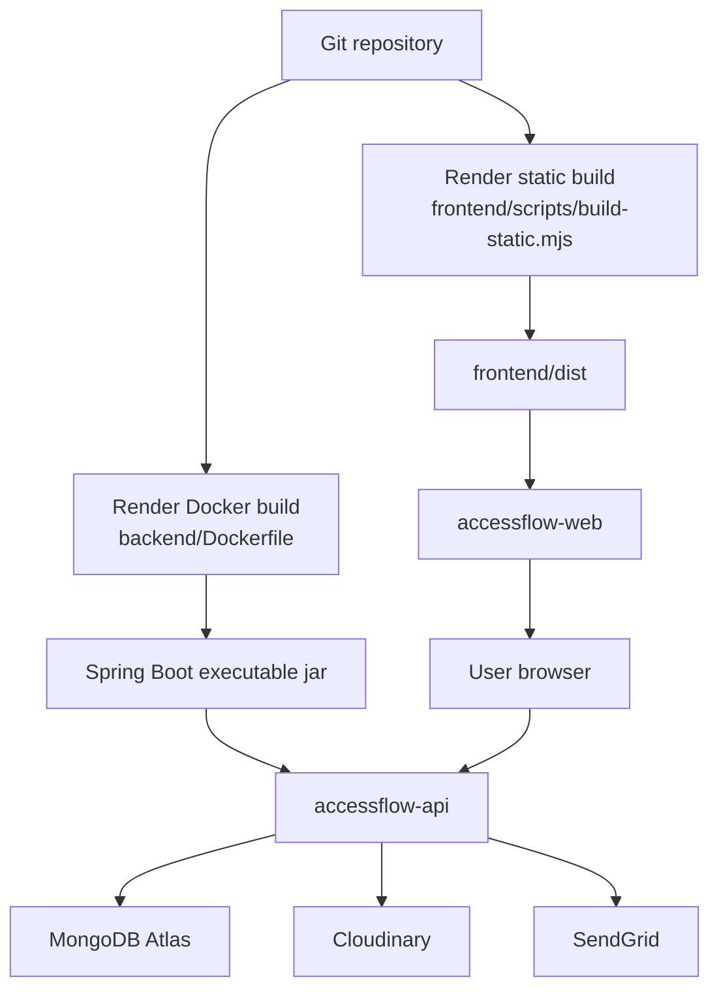
```mermaid
flowchart TD
    Repo["Git repository"] --> WebBuild["Render static build<br/>frontend/scripts/build-static.mjs"]
    Repo --> ApiBuild["Render Docker build<br/>backend/Dockerfile"]
    WebBuild --> Dist["frontend/dist"]
    Dist --> Web["accessflow-web"]
    ApiBuild --> Jar["Spring Boot executable jar"]
    Jar --> Api["accessflow-api"]
    Web --> Browser["User browser"]
    Browser --> Api
    Api --> Mongo["MongoDB Atlas"]
    Api --> Cloudinary["Cloudinary"]
    Api --> SendGrid["SendGrid"]
```

### MongoDB, Cloudinary, JWT, And Render Responsibilities

- MongoDB stores organizations, departments, users, visitors, attendance logs, notification queue records, audit trails, refresh tokens, password reset records, and super-admin OTP records.
- Cloudinary stores visitor and workforce photos uploaded through multipart endpoints.
- JWT access tokens carry identity and role claims. Refresh tokens are opaque, stored by hash, rotated on refresh, and revoked on logout or password reset.
- Render hosts the frontend as a static site and the backend as a Docker web service. `render.yaml` defines cache headers, SPA route rewrites, environment variables, and health checks.

## B. Complete Flow Diagrams

### Auth Flow

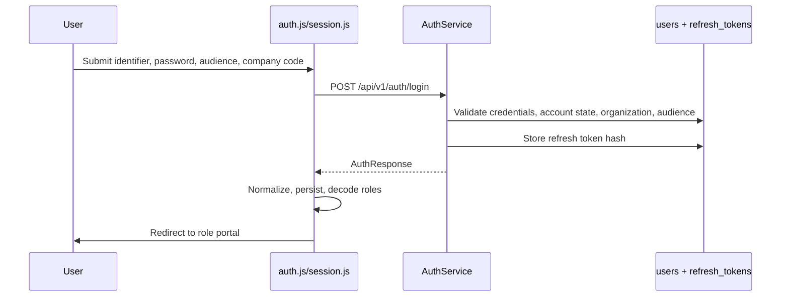
```mermaid
sequenceDiagram
    participant User
    participant FE as auth.js/session.js
    participant API as AuthService
    participant DB as users + refresh_tokens

    User->>FE: Submit identifier, password, audience, company code
    FE->>API: POST /api/v1/auth/login
    API->>DB: Validate credentials, account state, organization, audience
    API->>DB: Store refresh token hash
    API-->>FE: AuthResponse
    FE->>FE: Normalize, persist, decode roles
    FE->>User: Redirect to role portal
```

### Logout Flow

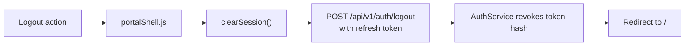
```mermaid
flowchart LR
    Click["Logout action"] --> Shell["portalShell.js"]
    Shell --> Clear["clearSession()"]
    Clear --> Revoke["POST /api/v1/auth/logout<br/>with refresh token"]
    Revoke --> TokenStore["AuthService revokes token hash"]
    TokenStore --> Home["Redirect to /"]
```

### Token Lifecycle And Session Restore

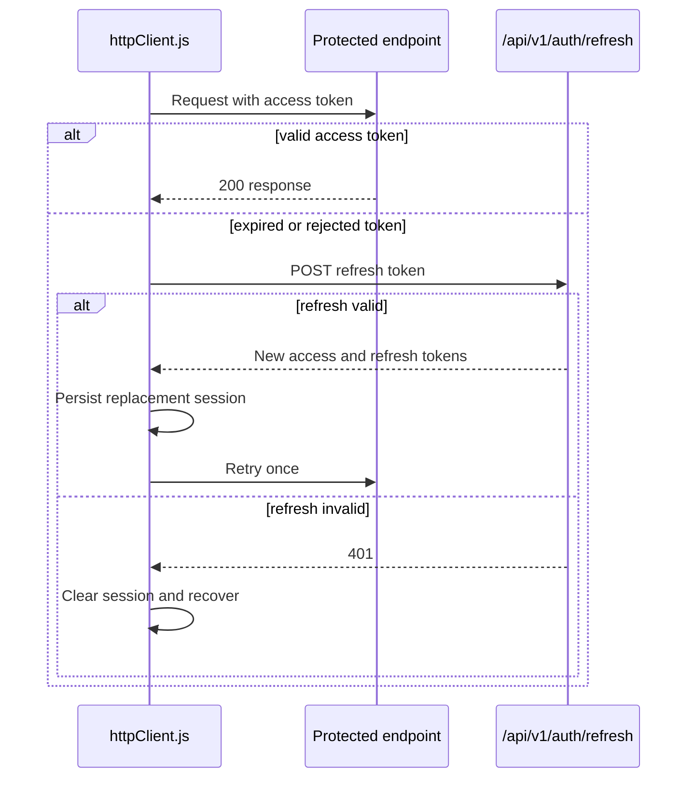
```mermaid
sequenceDiagram
    participant FE as httpClient.js
    participant API as Protected endpoint
    participant Auth as /api/v1/auth/refresh

    FE->>API: Request with access token
    alt valid access token
        API-->>FE: 200 response
    else expired or rejected token
        FE->>Auth: POST refresh token
        alt refresh valid
            Auth-->>FE: New access and refresh tokens
            FE->>FE: Persist replacement session
            FE->>API: Retry once
        else refresh invalid
            Auth-->>FE: 401
            FE->>FE: Clear session and recover
        end
    end
```

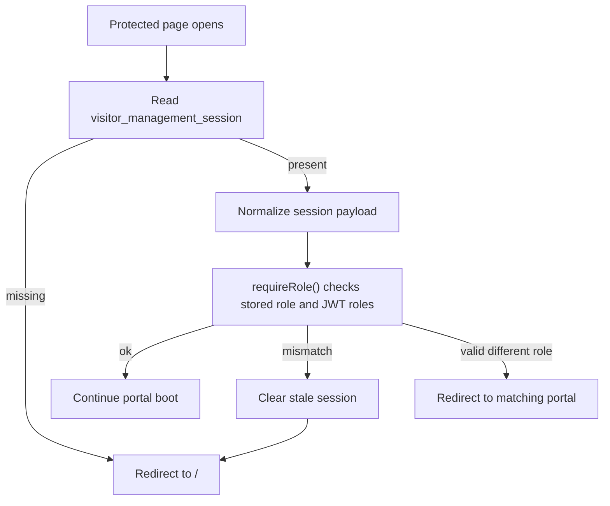
```mermaid
flowchart TD
    Open["Protected page opens"] --> Stored["Read visitor_management_session"]
    Stored -->|missing| Login["Redirect to /"]
    Stored -->|present| Normalize["Normalize session payload"]
    Normalize --> Role["requireRole() checks stored role and JWT roles"]
    Role -->|ok| Portal["Continue portal boot"]
    Role -->|mismatch| Clear["Clear stale session"]
    Clear --> Login
    Role -->|valid different role| Redirect["Redirect to matching portal"]
```

### Stale Session And Frontend Version Recovery

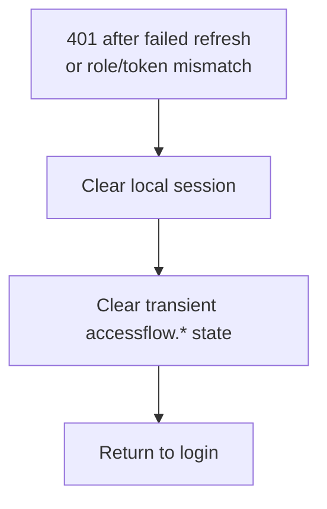
```mermaid
flowchart TD
    Stale["401 after failed refresh<br/>or role/token mismatch"] --> Clear["Clear local session"]
    Clear --> Storage["Clear transient accessflow.* state"]
    Storage --> Login["Return to login"]
```

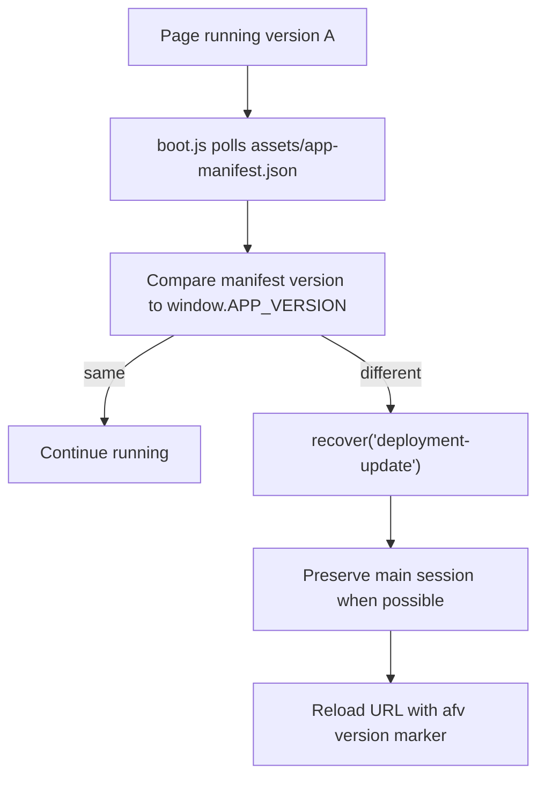
```mermaid
flowchart TD
    Page["Page running version A"] --> Poll["boot.js polls assets/app-manifest.json"]
    Poll --> Compare["Compare manifest version to window.APP_VERSION"]
    Compare -->|same| Continue["Continue running"]
    Compare -->|different| Recover["recover('deployment-update')"]
    Recover --> Preserve["Preserve main session when possible"]
    Preserve --> Reload["Reload URL with afv version marker"]
```

### Visitor Flows

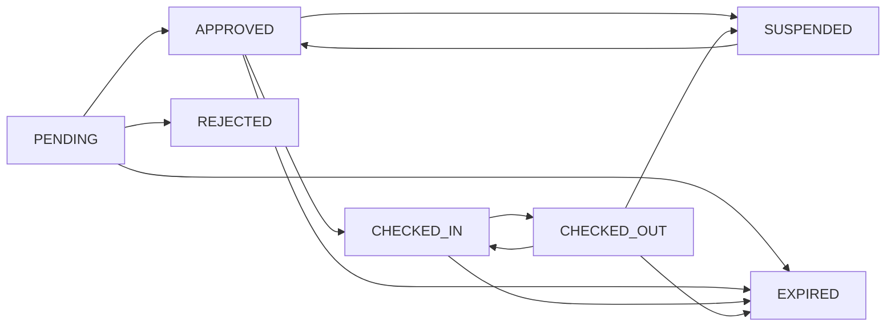
```mermaid
flowchart LR
    PENDING["PENDING"] --> APPROVED["APPROVED"]
    PENDING --> REJECTED["REJECTED"]
    PENDING --> EXPIRED["EXPIRED"]
    APPROVED --> CHECKEDIN["CHECKED_IN"]
    APPROVED --> EXPIRED
    CHECKEDIN --> CHECKEDOUT["CHECKED_OUT"]
    CHECKEDIN --> EXPIRED
    CHECKEDOUT --> CHECKEDIN
    APPROVED --> SUSPENDED["SUSPENDED"]
    CHECKEDOUT --> SUSPENDED
    SUSPENDED --> APPROVED
    CHECKEDOUT --> EXPIRED
```

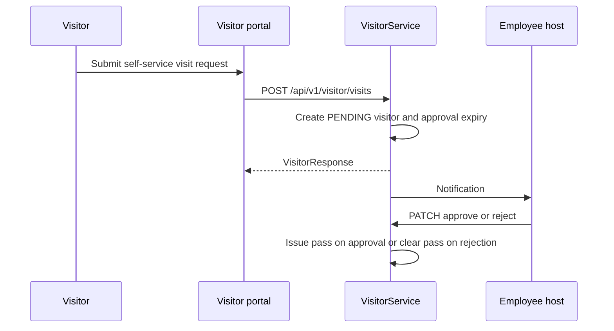
```mermaid
sequenceDiagram
    participant Visitor
    participant Portal as Visitor portal
    participant API as VisitorService
    participant Host as Employee host

    Visitor->>Portal: Submit self-service visit request
    Portal->>API: POST /api/v1/visitor/visits
    API->>API: Create PENDING visitor and approval expiry
    API-->>Portal: VisitorResponse
    API->>Host: Notification
    Host->>API: PATCH approve or reject
    API->>API: Issue pass on approval or clear pass on rejection
```

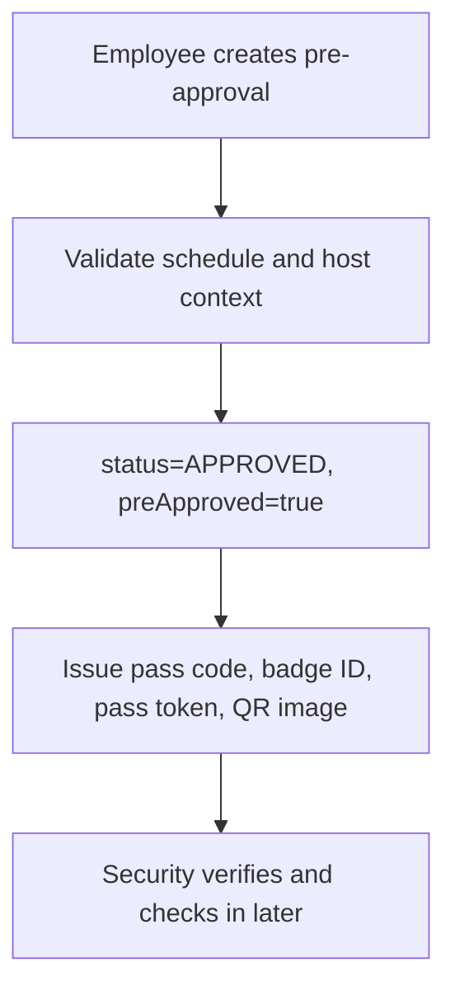
```mermaid
flowchart TD
    Employee["Employee creates pre-approval"] --> Validate["Validate schedule and host context"]
    Validate --> Approved["status=APPROVED, preApproved=true"]
    Approved --> Pass["Issue pass code, badge ID, pass token, QR image"]
    Pass --> Scan["Security verifies and checks in later"]
```

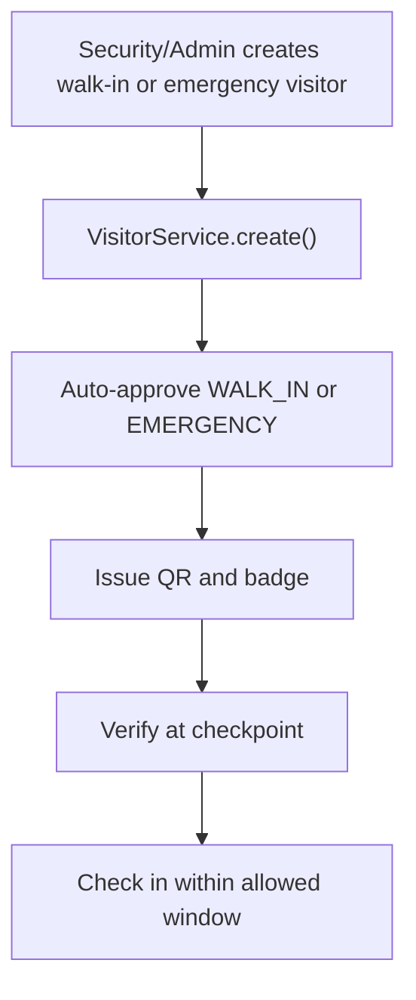
```mermaid
flowchart TD
    Desk["Security/Admin creates walk-in or emergency visitor"] --> Create["VisitorService.create()"]
    Create --> Auto["Auto-approve WALK_IN or EMERGENCY"]
    Auto --> Pass["Issue QR and badge"]
    Pass --> Verify["Verify at checkpoint"]
    Verify --> CheckIn["Check in within allowed window"]
```

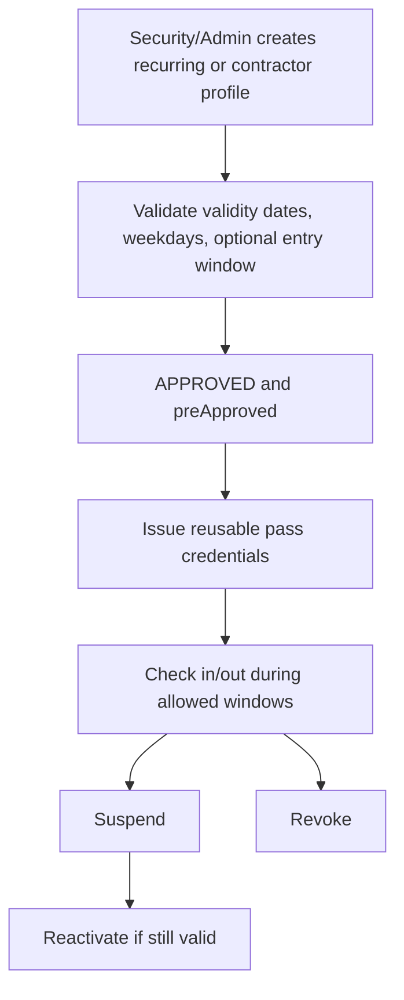
```mermaid
flowchart TD
    Create["Security/Admin creates recurring or contractor profile"] --> Window["Validate validity dates, weekdays, optional entry window"]
    Window --> Approve["APPROVED and preApproved"]
    Approve --> Reusable["Issue reusable pass credentials"]
    Reusable --> Use["Check in/out during allowed windows"]
    Use --> Suspend["Suspend"]
    Use --> Revoke["Revoke"]
    Suspend --> Reactivate["Reactivate if still valid"]
```

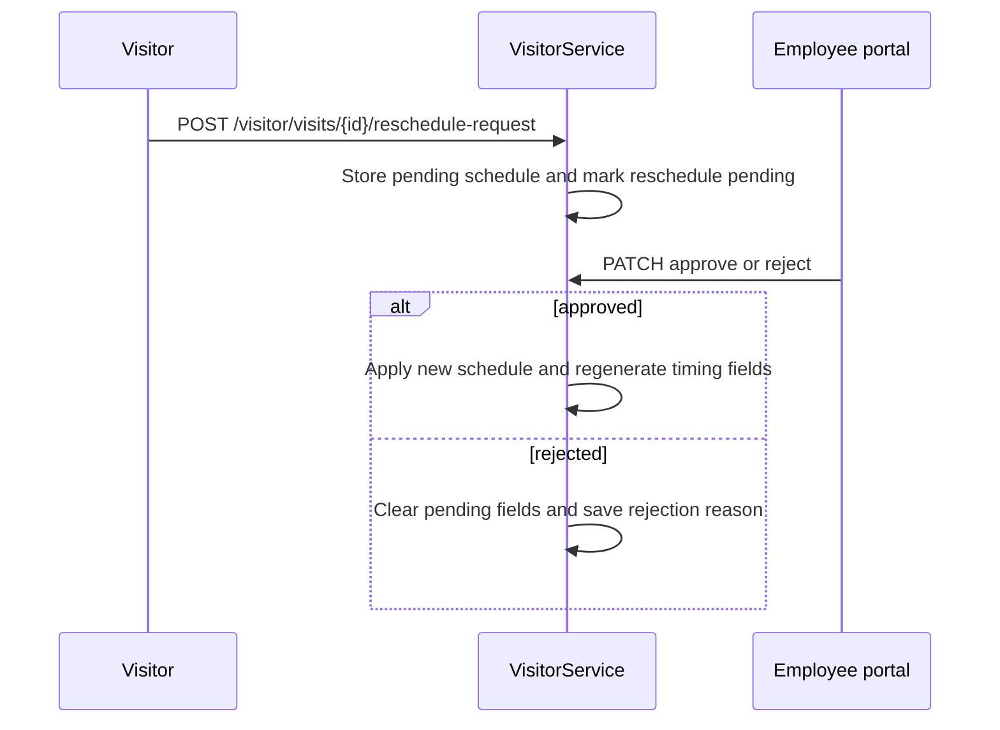
```mermaid
sequenceDiagram
    participant Visitor
    participant API as VisitorService
    participant Host as Employee portal

    Visitor->>API: POST /visitor/visits/{id}/reschedule-request
    API->>API: Store pending schedule and mark reschedule pending
    Host->>API: PATCH approve or reject
    alt approved
        API->>API: Apply new schedule and regenerate timing fields
    else rejected
        API->>API: Clear pending fields and save rejection reason
    end
```

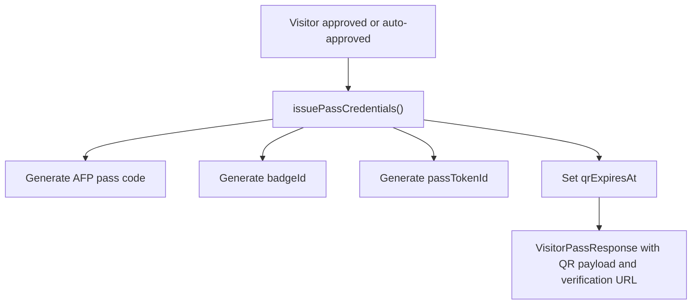
```mermaid
flowchart TD
    Approved["Visitor approved or auto-approved"] --> Issue["issuePassCredentials()"]
    Issue --> Code["Generate AFP pass code"]
    Issue --> Badge["Generate badgeId"]
    Issue --> Token["Generate passTokenId"]
    Issue --> Expiry["Set qrExpiresAt"]
    Expiry --> Response["VisitorPassResponse with QR payload and verification URL"]
```

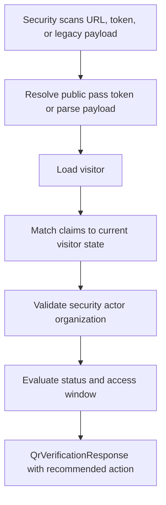
```mermaid
flowchart TD
    Scan["Security scans URL, token, or legacy payload"] --> Extract["Resolve public pass token or parse payload"]
    Extract --> Load["Load visitor"]
    Load --> Claims["Match claims to current visitor state"]
    Claims --> Org["Validate security actor organization"]
    Org --> State["Evaluate status and access window"]
    State --> Result["QrVerificationResponse with recommended action"]
```

### Employee And Workforce Flows

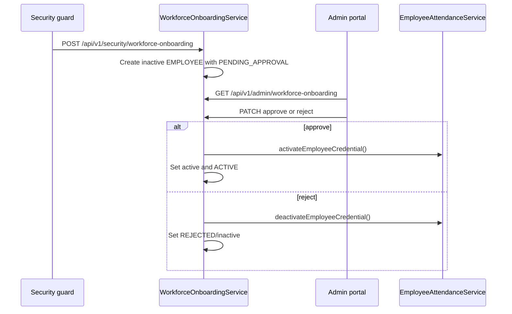
```mermaid
sequenceDiagram
    participant Guard as Security guard
    participant API as WorkforceOnboardingService
    participant Admin as Admin portal
    participant Attendance as EmployeeAttendanceService

    Guard->>API: POST /api/v1/security/workforce-onboarding
    API->>API: Create inactive EMPLOYEE with PENDING_APPROVAL
    Admin->>API: GET /api/v1/admin/workforce-onboarding
    Admin->>API: PATCH approve or reject
    alt approve
        API->>Attendance: activateEmployeeCredential()
        API->>API: Set active and ACTIVE
    else reject
        API->>Attendance: deactivateEmployeeCredential()
        API->>API: Set REJECTED/inactive
    end
```

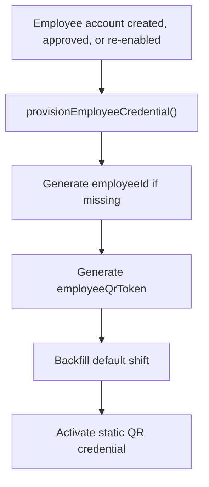
```mermaid
flowchart TD
    Account["Employee account created, approved, or re-enabled"] --> Provision["provisionEmployeeCredential()"]
    Provision --> Id["Generate employeeId if missing"]
    Id --> Token["Generate employeeQrToken"]
    Token --> Shift["Backfill default shift"]
    Shift --> Active["Activate static QR credential"]
```

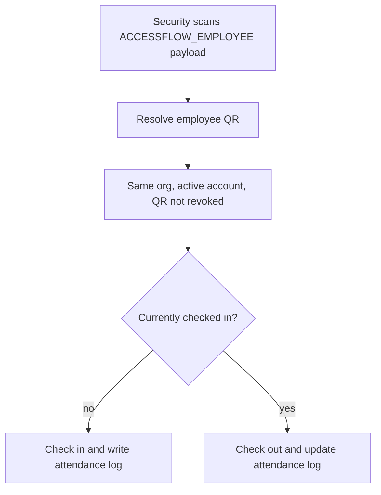
```mermaid
flowchart TD
    Scan["Security scans ACCESSFLOW_EMPLOYEE payload"] --> Resolve["Resolve employee QR"]
    Resolve --> Validate["Same org, active account, QR not revoked"]
    Validate --> State{"Currently checked in?"}
    State -->|no| In["Check in and write attendance log"]
    State -->|yes| Out["Check out and update attendance log"]
```

```mermaid
flowchart LR
    Guard["Security guard"] --> Reason["Enter required override reason"]
    Reason --> In["PATCH /security/employees/{id}/check-in"]
    Reason --> Out["PATCH /security/employees/{id}/check-out"]
    In --> Audit["Access audit log"]
    Out --> Audit
```

### Security Flows

```mermaid
flowchart TD
    Badge["Visitor badge scan"] --> Verify["POST /api/v1/security/qr-verification"]
    Verify --> Decision{"Verification result"}
    Decision -->|canCheckIn| CheckIn["POST /api/v1/security/qr-check-in"]
    Decision -->|canCheckOut| CheckOut["PATCH /api/v1/security/visitors/{id}/check-out"]
    Decision -->|invalid or review| Deny["Deny or escalate"]
    CheckIn --> Audit["Visitor and access audit logging"]
    CheckOut --> Audit
```

```mermaid
flowchart TD
    EmployeeQr["Employee QR scan"] --> Attendance["POST /api/v1/security/employees/qr-scan"]
    Attendance --> Verify["Validate active employee credential"]
    Verify --> Toggle["Toggle check-in/check-out"]
    Toggle --> Audit["Attendance and access audit logs"]
```

### Admin And Super Admin Flows

```mermaid
flowchart TD
    Admin["ADMIN portal"] --> Users["Create/manage org users"]
    Admin --> Departments["Create/rename/toggle departments"]
    Admin --> Workforce["Approve workforce onboarding"]
    Admin --> Visitors["Operate visitor access workspace"]
    Admin --> Reports["View org-scoped reports"]
```

```mermaid
flowchart TD
    Super["SUPER_ADMIN portal"] --> Org["Create/update organizations"]
    Super --> Workspace["Open organization workspace summaries"]
    Super --> Homepage["Manage homepage settings"]
    Super --> Monitoring["View platform monitoring"]
    Super --> OTP["Request OTP for super-admin creation"]
    OTP --> Create["Create SUPER_ADMIN with password confirmation and OTP"]
```

### Frontend Runtime Flows

```mermaid
flowchart TD
    Load["Browser loads entry page"] --> Boot["boot.js installs runtime"]
    Boot --> Version["Check stored app version"]
    Version --> Boundary["Install app error boundary"]
    Boundary --> Module["Load role module"]
    Module --> Role["Restore session and require role"]
    Role --> Data["Fetch initial dashboard data"]
    Data --> Ready["markReady()"]
```

```mermaid
flowchart TD
    Error["Failed script/style/module load or stale import error"] --> Detect["Recoverable runtime error?"]
    Detect -->|no| Toast["Show non-fatal error"]
    Detect -->|yes| Recover["Clear transient runtime state"]
    Recover --> Reload["Reload current route on fresh assets"]
```

## C. File And Folder Structure

### Frontend Structure

```text
frontend/
+-- index.html
+-- assets/
|   +-- branding/
|   \-- js/
|       +-- boot.js
|       \-- env.js
+-- css/
|   +-- admin/
|   +-- employee/
|   +-- pass/
|   +-- security/
|   +-- shared/
|   \-- visitor/
+-- js/
|   +-- admin/dashboard.js
|   +-- employee/dashboard.js
|   +-- pass/verify.js
|   +-- security/dashboard.js
|   +-- shared/
|   +-- visitor/dashboard.js
|   +-- auth.js
|   \-- passwordReset.js
+-- pages/
|   +-- admin/index.html
|   +-- employee/index.html
|   +-- forgot-password/index.html
|   +-- pass/index.html
|   +-- reset-password/index.html
|   +-- security/index.html
|   +-- verify-otp/index.html
|   \-- visitor/index.html
\-- scripts/build-static.mjs
```

### Backend Structure

```text
backend/
+-- Dockerfile
+-- pom.xml
\-- src/
    +-- main/
    |   +-- java/com/visitor/management/
    |   |   +-- config/
    |   |   +-- controller/
    |   |   +-- dto/
    |   |   +-- entity/
    |   |   +-- exception/
    |   |   +-- repository/
    |   |   +-- security/
    |   |   +-- service/
    |   |   \-- validation/
    |   \-- resources/
    |       +-- application.yml
    |       +-- application-local.yml
    |       +-- application-prod.yml
    |       \-- logback-spring.xml
    \-- test/
        +-- java/com/visitor/management/
        \-- resources/application-test.yml
```

### Responsibilities And Layering

| Area | Responsibility |
| --- | --- |
| `frontend/assets/js` | runtime boot, environment constants, deploy metadata |
| `frontend/js/shared` | session, HTTP client, role guard, portal shell, API wrappers, badge rendering, shared visitor module |
| `frontend/js/{admin,employee,security,visitor}` | role-specific dashboard orchestration |
| `frontend/pages` | static HTML entry points and route targets |
| `backend/controller` | HTTP endpoints grouped by audience or domain |
| `backend/service` | business rules, lifecycle state, QR handling, integrations, audit writes |
| `backend/repository` | Spring Data MongoDB access |
| `backend/entity` | MongoDB documents and enums |
| `backend/dto` | request validation and response shaping |
| `backend/security` | JWT, filters, access-denied/entrypoint handling, route security |
| `backend/config` | CORS, Cloudinary, Mongo indexes, production validation, cache, startup bootstrapping |

## D. Frontend Architecture

The frontend is a static multi-entry app, not a bundled React/Vue SPA. It behaves like an SPA within each portal shell: admin uses path-routed workspace views, while employee, security, and visitor portals use in-page section routing.

Startup pattern:

1. Entry HTML loads `assets/js/boot.js`, `assets/js/env.js`, CSS, and the portal module.
2. `bootstrapApplication()` checks deployment version and wraps startup.
3. `initAppErrorBoundary()` catches recoverable runtime failures.
4. `requireRole()` restores and validates the session for protected portals.
5. `initPortalShell()` initializes sidebar, topbar, logout, notifications, health checks, and refresh behavior.
6. The dashboard module loads initial data and starts polling where needed.

Auth/session handling:

- `session.js` stores `visitor_management_session` in localStorage with schema and app version metadata.
- `roleGuard.js` verifies both stored roles and decoded JWT roles.
- `httpClient.js` attaches bearer tokens, refreshes once on `401`, retries the original request, and clears the session when refresh fails.
- `portalShell.js` sends logout with `keepalive` when possible and then returns the user to `/`.

Runtime recovery:

- `boot.js` polls `assets/app-manifest.json` every 60 seconds while visible.
- `appRuntime.js` handles deployment mismatch refresh and storage cleanup.
- `appErrorBoundary.js` detects stale module/asset failures and initiates recovery.
- Deployment refresh usually preserves the main session; invalid auth state clears it.

Cache/versioning:

- `build-static.mjs` copies source into `frontend/dist/`, writes deploy-specific `env.js`, writes `app-manifest.json`, and stamps local JS/CSS/module references with `?v=<assetToken>`.
- Render serves HTML and manifests as `no-store` and versioned JS/CSS as immutable.

## E. Backend Architecture

```mermaid
flowchart TD
    Request["HTTP request"] --> Filters["RequestLoggingFilter<br/>ApiRateLimitFilter<br/>InputSanitizationFilter<br/>JwtAuthenticationFilter"]
    Filters --> Security["SecurityConfig"]
    Security --> Controller["Controller layer"]
    Controller --> Service["Service layer"]
    Service --> Repository["Mongo repositories / MongoTemplate"]
    Repository --> Mongo["MongoDB"]
    Service --> External["Cloudinary / SendGrid"]
    Service --> Audit["AccessAuditService / VisitorAuditLog"]
```

Controller responsibilities:

| Controller | Base path | Responsibility |
| --- | --- | --- |
| `AuthController` | `/api/v1/auth` | login, register, refresh, logout, password reset |
| `OrganizationController` | `/api/v1/organizations` | public org list, org CRUD, workspace summaries |
| `HomepageController` | `/api/v1/homepage` | public homepage and super-admin homepage settings |
| `AdminController` | `/api/v1/admin` | analytics, users, departments, reports, monitoring, visitors, workforce |
| `EmployeeController` | `/api/v1/employee` | host approvals, pre-approvals, own badge/attendance, host-owned visitors |
| `SecurityPortalController` | `/api/v1/security` | checkpoint operations, QR scans, workforce intake, attendance operations |
| `VisitorPortalController` | `/api/v1/visitor` | visitor self-service visits, history, hosts, passes, reschedules |
| `NotificationController` | `/api/v1/notifications` | notification reads |
| `PublicBadgeVerificationController` | `/api/v1/public` | public pass verification |
| `HealthController` | `/api/v1/health` | health, liveness, readiness |
| `VersionController` | `/api/versions` | API version metadata |

Service responsibilities:

- `AuthService`: registration, login, org-code enforcement, refresh rotation, logout revocation, password reset OTP, reset-token handling.
- `VisitorService`: visitor creation, approval, rejection, recurring visitor rules, pass issuance, QR verification, check-in/out, rescheduling, expiry, monitoring, audit history.
- `EmployeeAttendanceService`: employee credential provisioning, static QR activation/revocation, employee badge generation, QR attendance toggles, manual overrides, analytics.
- `WorkforceOnboardingService`: security-assisted onboarding, pending approval queue, admin update, approval, rejection, QR activation/deactivation.
- `AdminUserService`: internal user creation, enable/disable, role updates, super-admin OTP creation, password reset.
- `OrganizationService` and `DepartmentService`: tenant metadata, active organization resolution, scoped department rules.
- `NotificationService` and dispatchers: in-app notification queue and asynchronous SendGrid delivery.

DTO flow:

1. Controller accepts a validated request DTO.
2. Service resolves authenticated actor and business context.
3. Service loads and mutates entities.
4. Service maps entities into response DTOs or `ApiResponse<T>`.

RBAC enforcement:

- `SecurityConfig` protects route families.
- `@PreAuthorize` narrows privileged methods.
- `JwtAuthenticationFilter` confirms active account state, current roles, and token issue time.
- Services enforce organization scope, host ownership, lifecycle state, and manual override requirements.

QR validation:

- Visitor pass verification resolves public pass URLs, pass tokens, and legacy payloads, then validates current visitor state, token claims, organization scope, status, and access window.
- Employee attendance QR uses the static `ACCESSFLOW_EMPLOYEE:` payload format and is processed separately by `EmployeeAttendanceService`.

## F. Database Design

```mermaid
erDiagram
    ORGANIZATIONS ||--o{ USERS : organizationId
    ORGANIZATIONS ||--o{ DEPARTMENTS : organizationId
    ORGANIZATIONS ||--o{ VISITORS : organizationId
    USERS ||--o{ REFRESH_TOKENS : userId
    USERS ||--o{ PASSWORD_RESET_TOKENS : userId
    USERS ||--o{ SUPER_ADMIN_CREATION_OTPS : actorUserId
    USERS ||--o{ NOTIFICATIONS : recipientUserId
    USERS ||--o{ EMPLOYEE_ATTENDANCE_LOGS : employeeUserId
    USERS ||--o{ ACCESS_AUDIT_LOGS : actorId
    VISITORS ||--o{ VISITOR_AUDIT_LOGS : visitorId
```

Collections:

| Collection | Purpose |
| --- | --- |
| `users` | visitor and internal accounts, roles, org context, employee QR credentials |
| `organizations` | tenant root records |
| `departments` | tenant-scoped department directory |
| `visitors` | visitor lifecycle, scheduling, host, QR, badge, recurring data |
| `employee_attendance_logs` | workforce check-in/check-out history |
| `notifications` | in-app and email notification queue |
| `access_audit_logs` | platform, auth, account, organization, workforce, and attendance events |
| `visitor_audit_logs` | visitor lifecycle transitions |
| `refresh_tokens` | hashed refresh-token rotation records |
| `password_reset_tokens` | OTP and reset-token state |
| `super_admin_creation_otps` | OTP-confirmed super-admin creation state |
| `homepage_settings` | super-admin-managed public homepage settings |

Important indexes:

- `users`: unique email, unique sparse username, sparse employee ID, unique sparse employee QR token, organization fields.
- `visitors`: identity/search fields, organization, host, status, visitor type, timing fields, unique sparse QR code, badge ID, pass token, created time.
- `departments`: unique `organizationId + normalizedName`.
- `employee_attendance_logs`: employee, organization, date, state.
- `notifications`: recipient, type, read state, created time.
- `access_audit_logs` and `visitor_audit_logs`: actor/visitor/action and created-time lookup indexes.
- `super_admin_creation_otps`: TTL index for OTP expiry.

Lifecycle states:

| Visitor state | Meaning |
| --- | --- |
| `PENDING` | waiting for host/admin decision |
| `APPROVED` | approved and pass-ready |
| `REJECTED` | denied |
| `CHECKED_IN` | currently on site |
| `CHECKED_OUT` | departed; recurring visitors may re-enter |
| `EXPIRED` | approval or pass no longer valid |
| `SUSPENDED` | recurring profile blocked |

| Account status | Meaning |
| --- | --- |
| `ACTIVE` | usable account |
| `PENDING_APPROVAL` | security-submitted employee awaiting admin approval |
| `REJECTED` | workforce onboarding rejected |
| `DISABLED` | internal account disabled |
| `LOCKED` | enum exists; current flows do not actively assign it |

## G. RBAC Matrix

| Role | Portal | Permissions | Hidden or restricted UI | Backend enforcement |
| --- | --- | --- | --- | --- |
| `SUPER_ADMIN` | `/admin/*` | platform analytics, org CRUD, homepage settings, monitoring, super-admin OTP flow, audit visibility, visitor access | none of the super-admin admin routes are hidden | `hasRole('SUPER_ADMIN')`, service checks |
| `ADMIN` | `/admin/*` | own-org analytics, user management without super-admin elevation, departments, workforce approval, visitor access, reports | organizations, homepage controls, platform monitoring | route rules plus admin/org service restrictions |
| `SECURITY_GUARD` | `/security` | visitor queue, QR verification, QR check-in, manual visitor override, visitor registration, recurring visitor controls, workforce onboarding, employee attendance scan | admin and employee workspaces | `/api/v1/security/**`, org checks, employee same-org checks |
| `EMPLOYEE` | `/employee` | approve/reject host visitors, pre-approve visitors, reschedule, own attendance, own badge, host-owned visitor creation | security and admin flows | `/api/v1/employee/**`, host ownership checks |
| `VISITOR` | `/pages/visitor/index.html` | request visits, view history, open approved pass, request reschedule | internal portals and org management | `/api/v1/visitor/**`, visitor email/org checks |

Frontend behavior:

- `SUPER_ADMIN` is treated as effectively allowed on admin routes.
- Admin navigation is reduced for non-super-admin sessions.
- Employee, security, and visitor shells expose only role-specific navigation.
- Login audience determines copy, validation, and post-login redirect.

Backend authority:

- Frontend hiding is convenience only.
- JWT, `SecurityConfig`, `@PreAuthorize`, service-level organization checks, and lifecycle rules decide access.
- Admins cannot create or assign `SUPER_ADMIN` through standard user management.
- Security guards and admins are constrained to their organization unless the actor is a super admin.

## H. API Documentation

Most endpoints return `ApiResponse<T>` with `success`, `message`, `data`, and `timestamp`. Login returns raw `AuthResponse`; paginated lists use `PageResponse<T>` inside `ApiResponse`.

### Public And Auth

| Method | Path | Auth | Roles | Notes |
| --- | --- | --- | --- | --- |
| `POST` | `/api/v1/auth/login` | No | Public | audience-aware login |
| `POST` | `/api/v1/auth/register` | No | Public | visitor account registration |
| `POST` | `/api/v1/auth/refresh` | No | Refresh token | rotates refresh token |
| `POST` | `/api/v1/auth/logout` | No | Refresh token | revokes refresh token if found |
| `POST` | `/api/v1/auth/forgot-password` | No | Public | starts OTP flow |
| `POST` | `/api/v1/auth/verify-otp` | No | Public | exchanges OTP for reset token |
| `POST` | `/api/v1/auth/reset-password` | No | Public | sets new password |
| `GET` | `/api/v1/auth/me` | Yes | Any role | current user profile |
| `GET` | `/api/v1/health`, `/live`, `/ready` | No | Public | health probes |
| `GET` | `/api/versions` | No | Public | API version metadata |
| `GET` | `/api/v1/public/passes/{token}` | No | Public | public pass verification |
| `GET` | `/api/v1/homepage` | No | Public | public homepage data |

### Organization, Homepage, Notifications

| Method | Path | Roles | Notes |
| --- | --- | --- | --- |
| `GET` | `/api/v1/organizations/public` | Public | active org list |
| `GET` | `/api/v1/organizations` | `SUPER_ADMIN`, `ADMIN` | accessible orgs |
| `GET` | `/api/v1/organizations/workspace` | `SUPER_ADMIN` | workspace list |
| `GET` | `/api/v1/organizations/{id}/workspace` | `SUPER_ADMIN` | workspace detail |
| `POST` | `/api/v1/organizations` | `SUPER_ADMIN` | create organization |
| `PUT` | `/api/v1/organizations/{id}` | `SUPER_ADMIN` | update organization |
| `GET` | `/api/v1/homepage/settings` | `SUPER_ADMIN` | settings |
| `PUT` | `/api/v1/homepage/settings` | `SUPER_ADMIN` | update settings |
| `GET` | `/api/v1/notifications` | Any authenticated role | latest notifications |
| `PATCH` | `/api/v1/notifications/{id}/read` | Recipient | mark one read |
| `PATCH` | `/api/v1/notifications/read-all` | Recipient | mark batch read |

### Visitor Portal

| Method | Path | Roles | Notes |
| --- | --- | --- | --- |
| `GET` | `/api/v1/visitor/overview` | `VISITOR` | summary |
| `GET` | `/api/v1/visitor/visits` | `VISITOR` | current visits |
| `GET` | `/api/v1/visitor/history` | `VISITOR` | history |
| `GET` | `/api/v1/visitor/hosts` | `VISITOR` | host lookup |
| `POST` | `/api/v1/visitor/visits` | `VISITOR` | create request |
| `POST` | `/api/v1/visitor/visits/photo` | `VISITOR` | photo upload |
| `GET` | `/api/v1/visitor/visits/{id}/pass` | `VISITOR` | approved pass |
| `POST` | `/api/v1/visitor/visits/{id}/reschedule-request` | `VISITOR` | request reschedule |

### Employee Portal

| Method | Path | Roles | Notes |
| --- | --- | --- | --- |
| `GET` | `/api/v1/employee/overview` | `EMPLOYEE` | metrics |
| `GET` | `/api/v1/employee/approvals` | `EMPLOYEE` | pending approvals |
| `GET` | `/api/v1/employee/pre-approvals` | `EMPLOYEE` | upcoming pre-approvals |
| `POST` | `/api/v1/employee/pre-approvals` | `EMPLOYEE` | create pre-approval |
| `GET` | `/api/v1/employee/attendance` | `EMPLOYEE` | own attendance |
| `GET` | `/api/v1/employee/badge` | `EMPLOYEE` | own badge |
| `GET` | `/api/v1/employee/visitors` | `EMPLOYEE` | host-owned search |
| `POST` | `/api/v1/employee/visitors` | `EMPLOYEE` | create visitor under host |
| `PATCH` | `/api/v1/employee/visitors/{id}/approve` | `EMPLOYEE` | approve |
| `PATCH` | `/api/v1/employee/visitors/{id}/reject` | `EMPLOYEE` | reject |
| `PUT` | `/api/v1/employee/visitors/{id}` | `EMPLOYEE` | update host-owned visitor |
| `PATCH` | `/api/v1/employee/visitors/{id}/reschedule` | `EMPLOYEE` | direct reschedule |
| `PATCH` | `/api/v1/employee/visitors/{id}/reschedule-request/approve` | `EMPLOYEE` | approve request |
| `PATCH` | `/api/v1/employee/visitors/{id}/reschedule-request/reject` | `EMPLOYEE` | reject request |

### Security Portal

| Method | Path | Roles | Notes |
| --- | --- | --- | --- |
| `GET` | `/api/v1/security/overview` | `SECURITY_GUARD` | metrics |
| `GET` | `/api/v1/security/checkins` | `SECURITY_GUARD` | checked-in visitors |
| `GET` | `/api/v1/security/photo-capture` | `SECURITY_GUARD` | photo metadata |
| `POST` | `/api/v1/security/qr-verification` | `SECURITY_GUARD` | verify visitor pass |
| `POST` | `/api/v1/security/qr-check-in` | `SECURITY_GUARD` | QR check-in |
| `GET` | `/api/v1/security/badges` | `SECURITY_GUARD` | badge queue |
| `GET` | `/api/v1/security/queue` | `SECURITY_GUARD` | live queue |
| `GET` | `/api/v1/security/visitors` | `SECURITY_GUARD` | visitor search |
| `GET` | `/api/v1/security/monitoring` | `SECURITY_GUARD` | monitoring board |
| `GET` | `/api/v1/security/hosts` | `SECURITY_GUARD` | host search |
| `GET` | `/api/v1/security/employees` | `SECURITY_GUARD` | employee directory |
| `POST` | `/api/v1/security/workforce-onboarding` | `SECURITY_GUARD` | onboarding intake |
| `POST` | `/api/v1/security/employees/qr-scan` | `SECURITY_GUARD` | employee QR scan |
| `PATCH` | `/api/v1/security/employees/{id}/check-in` | `SECURITY_GUARD` | manual employee check-in |
| `PATCH` | `/api/v1/security/employees/{id}/check-out` | `SECURITY_GUARD` | manual employee check-out |
| `GET` | `/api/v1/security/visitors/{id}/pass` | `SECURITY_GUARD` | visitor pass |
| `PATCH` | `/api/v1/security/visitors/{id}/check-in` | `SECURITY_GUARD` | direct check-in |
| `PATCH` | `/api/v1/security/visitors/{id}/override-check-in` | `SECURITY_GUARD` | manual override |
| `PATCH` | `/api/v1/security/visitors/{id}/check-out` | `SECURITY_GUARD` | check-out |
| `PATCH` | `/api/v1/security/visitors/{id}/suspend` | `SECURITY_GUARD` | suspend recurring |
| `PATCH` | `/api/v1/security/visitors/{id}/revoke` | `SECURITY_GUARD` | revoke recurring |
| `PATCH` | `/api/v1/security/visitors/{id}/reactivate` | `SECURITY_GUARD` | reactivate recurring |

### Admin

| Method | Path | Roles | Notes |
| --- | --- | --- | --- |
| `GET` | `/api/v1/admin/overview` | `ADMIN`, `SUPER_ADMIN` | overview |
| `GET` | `/api/v1/admin/analytics` | `ADMIN`, `SUPER_ADMIN` | analytics |
| `GET` | `/api/v1/admin/users` | `ADMIN`, `SUPER_ADMIN` | list users |
| `POST` | `/api/v1/admin/users` | `ADMIN`, `SUPER_ADMIN` | create internal user |
| `POST` | `/api/v1/admin/super-admins/otp` | `SUPER_ADMIN` | start super-admin OTP |
| `POST` | `/api/v1/admin/super-admins` | `SUPER_ADMIN` | create super admin |
| `PATCH` | `/api/v1/admin/users/{id}/disable` | `ADMIN`, `SUPER_ADMIN` | disable |
| `PATCH` | `/api/v1/admin/users/{id}/enable` | `ADMIN`, `SUPER_ADMIN` | enable |
| `PATCH` | `/api/v1/admin/users/{id}/reset-password` | `ADMIN`, `SUPER_ADMIN` | reset password |
| `PATCH` | `/api/v1/admin/users/{id}/role` | `ADMIN`, `SUPER_ADMIN` | update role with restrictions |
| `GET` | `/api/v1/admin/departments` | `ADMIN`, `SUPER_ADMIN` | list departments |
| `POST` | `/api/v1/admin/departments` | `ADMIN`, `SUPER_ADMIN` | create/reactivate department |
| `PATCH` | `/api/v1/admin/departments/{id}` | `ADMIN`, `SUPER_ADMIN` | rename/toggle |
| `GET` | `/api/v1/admin/workforce-onboarding` | `ADMIN`, `SUPER_ADMIN` | pending workforce |
| `PUT` | `/api/v1/admin/workforce-onboarding/{id}` | `ADMIN` | update worker |
| `PATCH` | `/api/v1/admin/workforce-onboarding/{id}/approve` | `ADMIN` | approve |
| `PATCH` | `/api/v1/admin/workforce-onboarding/{id}/reject` | `ADMIN` | reject |
| `GET` | `/api/v1/admin/monitoring` | `SUPER_ADMIN` | platform monitoring |
| `GET` | `/api/v1/admin/visitors` | `ADMIN`, `SUPER_ADMIN` | visitor search |
| `POST` | `/api/v1/admin/visitors` | `ADMIN`, `SUPER_ADMIN` | create visitor |
| `PUT` | `/api/v1/admin/visitors/{id}` | `ADMIN`, `SUPER_ADMIN` | update visitor |
| `PATCH` | `/api/v1/admin/visitors/{id}/check-in` | `ADMIN`, `SUPER_ADMIN` | check-in |
| `PATCH` | `/api/v1/admin/visitors/{id}/check-out` | `ADMIN`, `SUPER_ADMIN` | check-out |
| `DELETE` | `/api/v1/admin/visitors/{id}` | `ADMIN`, `SUPER_ADMIN` | delete |

### Request And Response Examples

Login request:

```json
{
  "identifier": "security.guard01",
  "password": "StrongPassword!123",
  "companyCode": "ACME",
  "portalAudience": "security"
}
```

Visitor QR verification request:

```json
{
  "qrPayload": "https://accessflow-web.onrender.com/pass/550e8400-e29b-41d4-a716-446655440000"
}
```

Representative QR verification response fields:

```json
{
  "valid": true,
  "recognized": true,
  "resultCode": "VALID_PASS",
  "headline": "Pass verified",
  "recommendedAction": "Confirm the visitor photo and identity, then complete check-in.",
  "visitorId": "6825visitor",
  "fullName": "Ravi Patel",
  "status": "APPROVED",
  "badgeId": "AFB-...",
  "passCode": "AFP-...",
  "canCheckIn": true,
  "canCheckOut": false
}
```

Workforce onboarding request:

```json
{
  "fullName": "Sanjay Kumar",
  "department": "Facilities",
  "phone": "9999999999",
  "designation": "Support staff",
  "employeeType": "SUPPORT_STAFF",
  "shiftName": "Morning Shift",
  "shiftStartTime": "09:00",
  "shiftEndTime": "18:00",
  "employeePhotoUrl": "https://res.cloudinary.com/.../worker.jpg"
}
```

## I. Responsive Strategy

Desktop workflows:

- Admin is desktop-first, path-routed, and optimized for analytics, users, departments, reports, organizations, monitoring, and visitor access.
- Employee and security dashboards use sidebar shells, multi-panel dashboards, badge previews, and repeated operational lists.

Mobile workflows:

- Visitor self-service is mobile-friendly and supports photo capture through file inputs.
- Auth, password reset, visitor history, and visitor pass access are designed to run in narrow viewports.
- Portal shell state collapses to mobile sidebar and backdrop behavior.

Tablet and security workflows:

- Security pages support front-desk and checkpoint usage.
- QR verification accepts hardware scanner input and camera scan fallback.
- Employee attendance scan supports pasted/static payloads and camera-based scanning.
- Badge preview and print/export workflows are most comfortable on tablet or desktop.

Responsive architecture:

- Shared `portalShell.js` controls sidebar behavior and topbar actions.
- Role CSS files keep portal-specific density and layout decisions separate.
- Runtime recovery notices are fixed overlays that remain reachable on mobile and desktop.

## J. Deployment And Versioning

Render services:

- `accessflow-api`: Docker web service, root `backend`, health check `/api/v1/health/live`.
- `accessflow-web`: static service, root `frontend`, publish path `dist`, build command `node ./scripts/build-static.mjs`.

Frontend deployment lifecycle:

```mermaid
flowchart TD
    Source["frontend source"] --> Copy["Copy into dist"]
    Copy --> Env["Write dist/assets/js/env.js"]
    Env --> Manifest["Write app-manifest.json"]
    Manifest --> Stamp["Stamp HTML, JS imports, CSS imports"]
    Stamp --> Publish["Publish dist as static site"]
```

Backend deployment lifecycle:

```mermaid
flowchart TD
    Pom["backend/pom.xml"] --> Maven["mvn package"]
    Maven --> Jar["visitor-management-backend jar"]
    Jar --> Docker["Docker runtime image"]
    Docker --> Prod["SPRING_PROFILES_ACTIVE=prod"]
    Prod --> Validate["ProductionEnvironmentValidator"]
    Validate --> Start["Render web process"]
```

Versioning and cache invalidation:

- Build metadata includes `window.APP_VERSION`, `window.APP_ASSET_TOKEN`, `window.APP_BUILD_TIMESTAMP`, and `window.APP_BUILD_REVISION`.
- Local HTML `src`/`href`, JS module imports, and CSS imports are stamped with the deploy asset token.
- `assets/app-manifest.json` and HTML are `no-store`.
- `assets/js/boot.js`, `/css/*`, and `/js/*` are immutable and safe because URLs include version tokens.

Stale-runtime recovery:

```mermaid
flowchart TD
    Old["User has old page open"] --> Deploy["New deploy publishes manifest and tokenized assets"]
    Deploy --> Poll["Old page polls manifest"]
    Poll --> Diff["Manifest version differs"]
    Diff --> Recover["Runtime clears transient state"]
    Recover --> Reload["Reloads current URL"]
    Reload --> Fresh["Fresh HTML points to current assets"]
```

Production guardrails:

- Required: `MONGODB_URI`, `JWT_SECRET`, `FRONTEND_PUBLIC_URL`, `CORS_ALLOWED_ORIGINS`.
- Production MongoDB should use a non-local Atlas URI.
- JWT secret must not be a placeholder.
- Public/CORS origins must be secure and non-wildcard.
- Cloudinary and SendGrid are optional at startup but required for full photo and email behavior.
