# AccessFlow Project Overview

This file is the single detailed source of truth for AccessFlow system architecture, workflows, RBAC, database design, API surface, responsive behavior, deployment, and versioning. The concise onboarding document remains [README.md](README.md).

<details>
<summary>Table of contents</summary>

- [A. System Architecture](#a-system-architecture)
- [B. Complete Flow Diagrams](#b-complete-flow-diagrams)
- [C. File And Folder Structure](#c-file-and-folder-structure)
- [D. Frontend Architecture](#d-frontend-architecture)
- [E. Backend Architecture](#e-backend-architecture)
- [F. Database Design](#f-database-design)
- [G. RBAC Matrix](#g-rbac-matrix)
- [H. API Documentation](#h-api-documentation)
- [I. Responsive Strategy](#i-responsive-strategy)
- [J. Deployment And Versioning](#j-deployment-and-versioning)

</details>

## A. System Architecture

AccessFlow is a static multi-entry frontend backed by a layered Spring Boot API. The browser loads an auth or portal entry point, syncs runtime configuration, restores the local session, checks deployment version state, and calls protected API routes with JWT access tokens. The backend validates JWT claims, account state, organization scope, and business rules before reading or mutating MongoDB documents.

### Overall Architecture

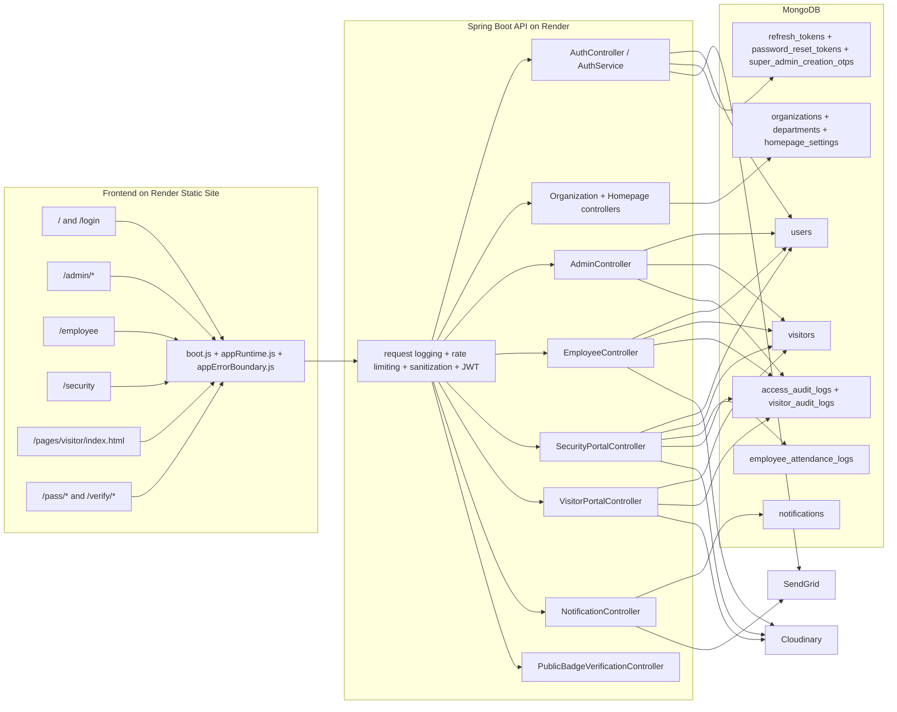
```mermaid
flowchart LR
    subgraph FE["Frontend on Render Static Site"]
        Login["/ and /login"]
        Admin["/admin/*"]
        Employee["/employee"]
        Security["/security"]
        Visitor["/pages/visitor/index.html"]
        Pass["/pass/* and /verify/*"]
        Runtime["boot.js + appRuntime.js + appErrorBoundary.js"]
    end

    subgraph API["Spring Boot API on Render"]
        Filters["request logging + rate limiting + sanitization + JWT"]
        Auth["AuthController / AuthService"]
        Org["Organization + Homepage controllers"]
        AdminApi["AdminController"]
        EmployeeApi["EmployeeController"]
        SecurityApi["SecurityPortalController"]
        VisitorApi["VisitorPortalController"]
        Notify["NotificationController"]
        PublicPass["PublicBadgeVerificationController"]
    end

    subgraph DB["MongoDB"]
        Users["users"]
        Visitors["visitors"]
        Orgs["organizations + departments + homepage_settings"]
        Attendance["employee_attendance_logs"]
        Notifications["notifications"]
        Audits["access_audit_logs + visitor_audit_logs"]
        Tokens["refresh_tokens + password_reset_tokens + super_admin_creation_otps"]
    end

    Cloudinary["Cloudinary"]
    SendGrid["SendGrid"]

    Login --> Runtime
    Admin --> Runtime
    Employee --> Runtime
    Security --> Runtime
    Visitor --> Runtime
    Pass --> Runtime

    Runtime --> Filters
    Filters --> Auth
    Filters --> Org
    Filters --> AdminApi
    Filters --> EmployeeApi
    Filters --> SecurityApi
    Filters --> VisitorApi
    Filters --> Notify
    Filters --> PublicPass

    Auth --> Users
    Auth --> Tokens
    Org --> Orgs
    AdminApi --> Users
    AdminApi --> Visitors
    EmployeeApi --> Users
    EmployeeApi --> Visitors
    SecurityApi --> Users
    SecurityApi --> Visitors
    SecurityApi --> Attendance
    VisitorApi --> Visitors
    Notify --> Notifications
    AdminApi --> Audits
    EmployeeApi --> Audits
    SecurityApi --> Audits
    VisitorApi --> Audits

    SecurityApi --> Cloudinary
    VisitorApi --> Cloudinary
    EmployeeApi --> Cloudinary
    Auth --> SendGrid
    Notify --> SendGrid
```

### Frontend And Backend Interaction

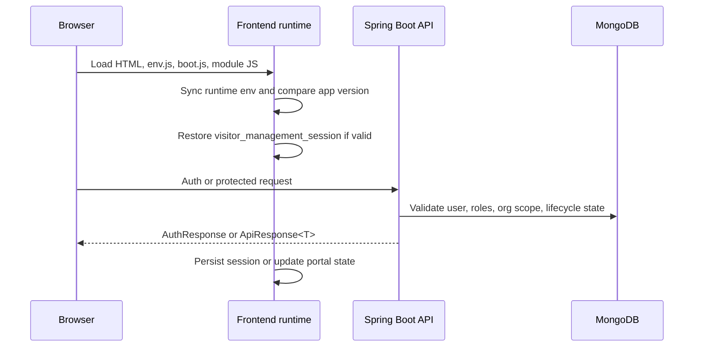
```mermaid
sequenceDiagram
    participant Browser
    participant Runtime as Frontend runtime
    participant API as Spring Boot API
    participant Mongo as MongoDB

    Browser->>Runtime: Load HTML, env.js, boot.js, module JS
    Runtime->>Runtime: Sync runtime env and compare app version
    Runtime->>Runtime: Restore visitor_management_session if valid
    Browser->>API: Auth or protected request
    API->>Mongo: Validate user, roles, org scope, lifecycle state
    API-->>Browser: AuthResponse or ApiResponse<T>
    Runtime->>Runtime: Persist session or update portal state
```

### Deployment Architecture

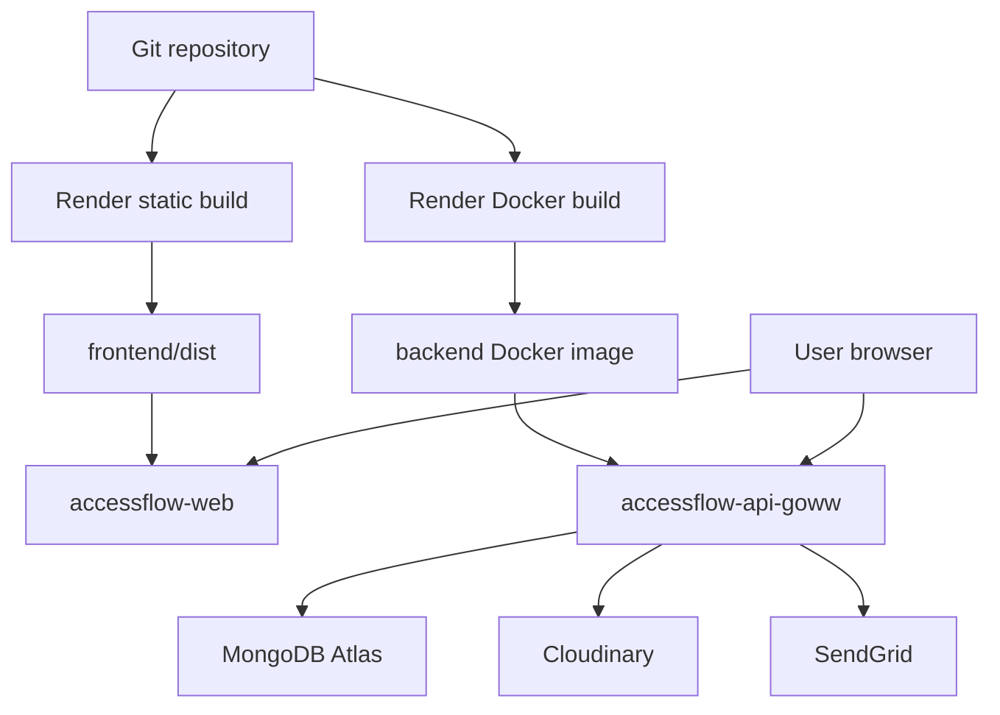
```mermaid
flowchart TD
    Repo["Git repository"] --> WebBuild["Render static build"]
    Repo --> ApiBuild["Render Docker build"]

    WebBuild --> Dist["frontend/dist"]
    Dist --> Web["accessflow-web"]

    ApiBuild --> Image["backend Docker image"]
    Image --> Api["accessflow-api-goww"]

    Browser["User browser"] --> Web
    Browser --> Api
    Api --> Mongo["MongoDB Atlas"]
    Api --> Cloudinary["Cloudinary"]
    Api --> SendGrid["SendGrid"]
```

### MongoDB Interaction

- `users` stores both internal accounts and visitor accounts.
- `visitors` stores one-time, walk-in, emergency, recurring, and contractor/vendor access records.
- `employee_attendance_logs` records static QR scans and manual employee presence overrides.
- `notifications` stores in-app notification records.
- `access_audit_logs` and `visitor_audit_logs` capture operator and lifecycle events.
- `refresh_tokens`, `password_reset_tokens`, and `super_admin_creation_otps` support auth recovery and privileged account creation.

### Cloudinary Integration

- Visitor photo uploads are accepted through visitor, employee, security, and admin endpoints depending on the flow.
- Workforce photo uploads are accepted through security onboarding, employee profile, and admin management flows.
- Stored `photoUrl` and `photoPublicId` fields are persisted on `Visitor` and `User`.

### JWT Authentication Architecture

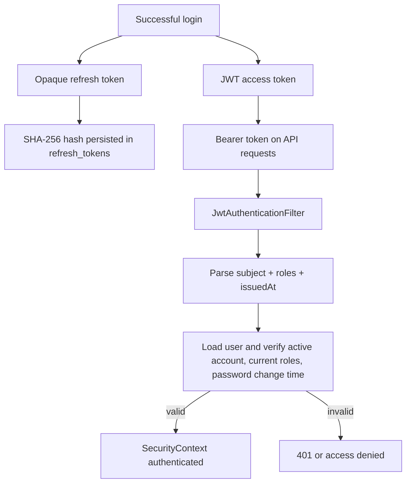
```mermaid
flowchart TD
    Login["Successful login"] --> Access["JWT access token"]
    Login --> Refresh["Opaque refresh token"]
    Refresh --> Hash["SHA-256 hash persisted in refresh_tokens"]
    Access --> Request["Bearer token on API requests"]
    Request --> Filter["JwtAuthenticationFilter"]
    Filter --> Claims["Parse subject + roles + issuedAt"]
    Claims --> UserCheck["Load user and verify active account, current roles, password change time"]
    UserCheck -->|valid| Authenticated["SecurityContext authenticated"]
    UserCheck -->|invalid| Rejected["401 or access denied"]
```

- Access tokens are JWTs signed with the configured secret and include `roles`, `sub`, `exp`, and optional email/password-change claims.
- Refresh tokens are random opaque tokens generated by `TokenService`, stored only as SHA-256 hashes, and rotated on `/api/v1/auth/refresh`.
- Logout revokes the current refresh token hash.
- Password reset revokes all active refresh tokens for the user.

### Render Deployment Architecture

- `render.yaml` defines one static web service and one Docker web service.
- The static service rewrites `/admin/*`, `/employee`, `/security`, `/pass/*`, and other public routes to the correct HTML entry points.
- The frontend build writes `dist/assets/js/env.js` and `dist/assets/app-manifest.json`, then stamps local JS and CSS references with a deployment token.
- The API service uses `/api/v1/health/live` as its Render health check.

## B. Complete Flow Diagrams

### Auth Flow

#### Login

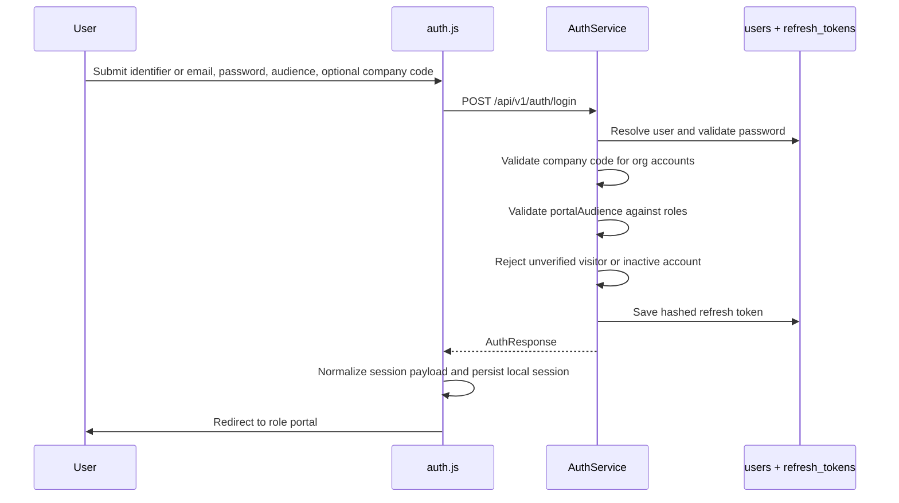
```mermaid
sequenceDiagram
    participant User
    participant FE as auth.js
    participant API as AuthService
    participant DB as users + refresh_tokens

    User->>FE: Submit identifier or email, password, audience, optional company code
    FE->>API: POST /api/v1/auth/login
    API->>DB: Resolve user and validate password
    API->>API: Validate company code for org accounts
    API->>API: Validate portalAudience against roles
    API->>API: Reject unverified visitor or inactive account
    API->>DB: Save hashed refresh token
    API-->>FE: AuthResponse
    FE->>FE: Normalize session payload and persist local session
    FE->>User: Redirect to role portal
```

Implementation notes:

- `SUPER_ADMIN` and `VISITOR` do not need a company code during login.
- Visitor accounts stay blocked until email verification is complete.
- Failed login attempts are rate-limited and written to access audit logs.

#### Logout

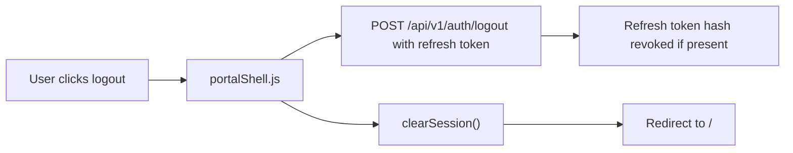
```mermaid
flowchart LR
    Click["User clicks logout"] --> Shell["portalShell.js"]
    Shell --> Api["POST /api/v1/auth/logout with refresh token"]
    Api --> Revoke["Refresh token hash revoked if present"]
    Shell --> Clear["clearSession()"]
    Clear --> Redirect["Redirect to /"]
```

#### Token Lifecycle

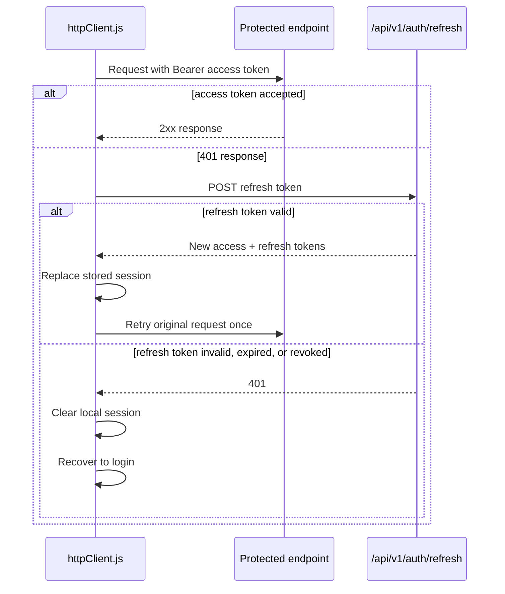
```mermaid
sequenceDiagram
    participant FE as httpClient.js
    participant API as Protected endpoint
    participant Refresh as /api/v1/auth/refresh

    FE->>API: Request with Bearer access token
    alt access token accepted
        API-->>FE: 2xx response
    else 401 response
        FE->>Refresh: POST refresh token
        alt refresh token valid
            Refresh-->>FE: New access + refresh tokens
            FE->>FE: Replace stored session
            FE->>API: Retry original request once
        else refresh token invalid, expired, or revoked
            Refresh-->>FE: 401
            FE->>FE: Clear local session
            FE->>FE: Recover to login
        end
    end
```

#### Session Restore

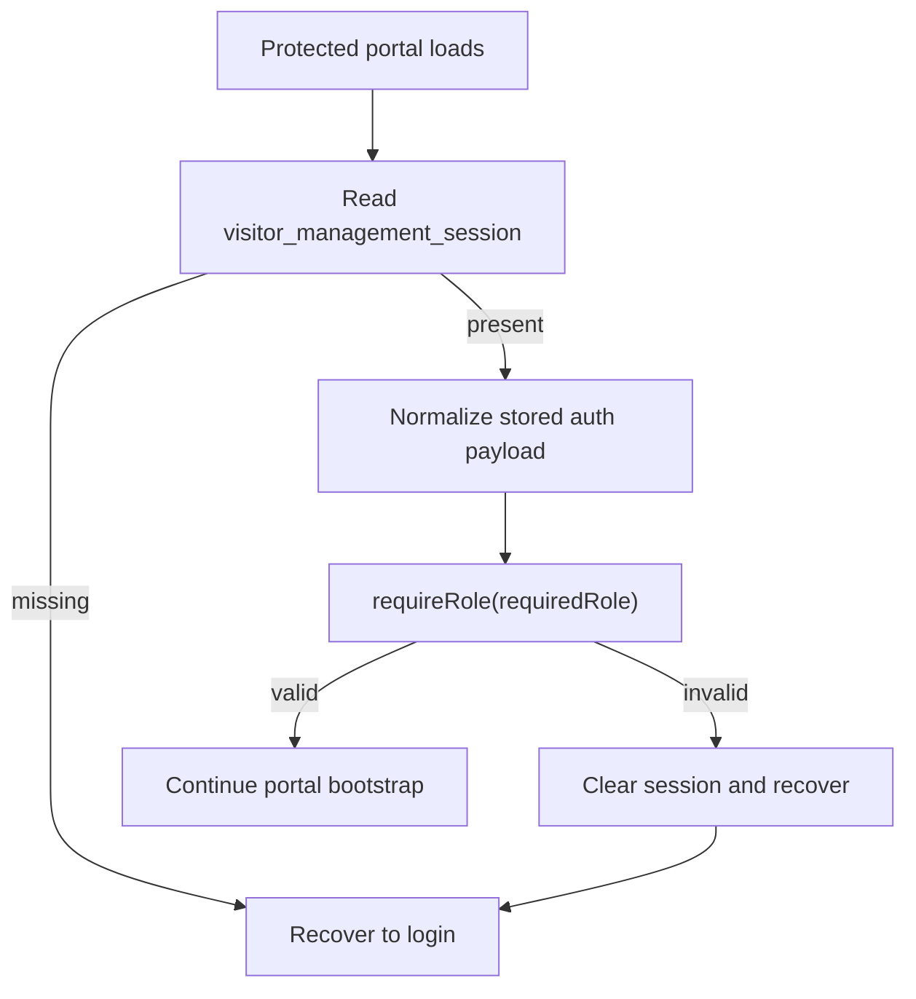
```mermaid
flowchart TD
    Open["Protected portal loads"] --> Read["Read visitor_management_session"]
    Read -->|missing| Login["Recover to login"]
    Read -->|present| Normalize["Normalize stored auth payload"]
    Normalize --> RoleCheck["requireRole(requiredRole)"]
    RoleCheck -->|valid| Portal["Continue portal bootstrap"]
    RoleCheck -->|invalid| Clear["Clear session and recover"]
    Clear --> Login
```

#### Stale Session Recovery

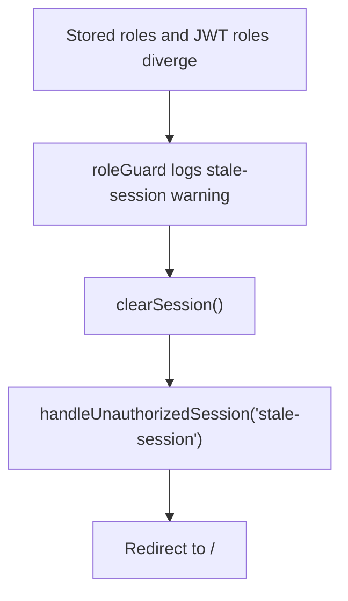
```mermaid
flowchart TD
    Mismatch["Stored roles and JWT roles diverge"] --> Warn["roleGuard logs stale-session warning"]
    Warn --> Clear["clearSession()"]
    Clear --> Recover["handleUnauthorizedSession('stale-session')"]
    Recover --> Login["Redirect to /"]
```

#### Frontend Version Mismatch Recovery

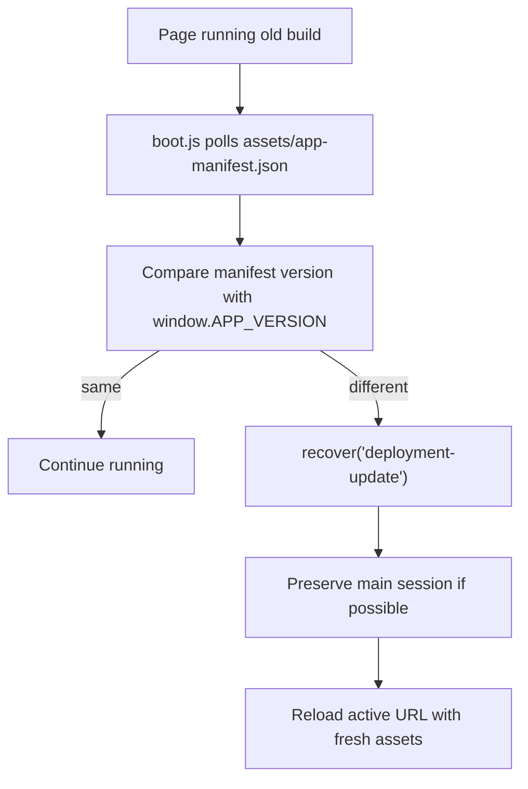
```mermaid
flowchart TD
    OldPage["Page running old build"] --> Poll["boot.js polls assets/app-manifest.json"]
    Poll --> Compare["Compare manifest version with window.APP_VERSION"]
    Compare -->|same| Continue["Continue running"]
    Compare -->|different| Recover["recover('deployment-update')"]
    Recover --> Preserve["Preserve main session if possible"]
    Preserve --> Reload["Reload active URL with fresh assets"]
```

#### Email Verification And Password Reset

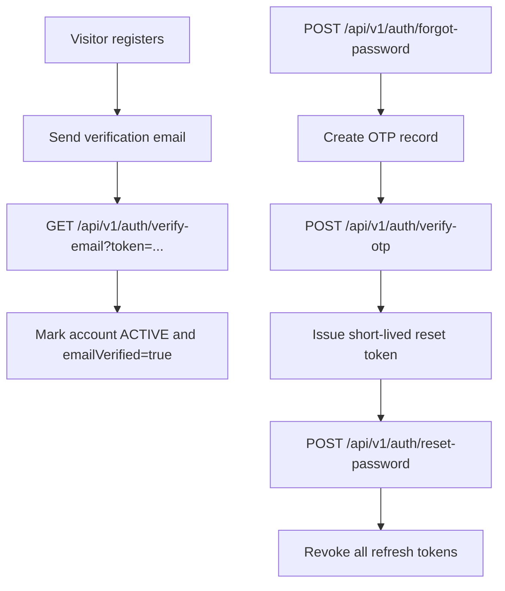
```mermaid
flowchart TD
    Register["Visitor registers"] --> Verify["Send verification email"]
    Verify --> Link["GET /api/v1/auth/verify-email?token=..."]
    Link --> Active["Mark account ACTIVE and emailVerified=true"]

    Forgot["POST /api/v1/auth/forgot-password"] --> Otp["Create OTP record"]
    Otp --> Check["POST /api/v1/auth/verify-otp"]
    Check --> ResetToken["Issue short-lived reset token"]
    ResetToken --> Reset["POST /api/v1/auth/reset-password"]
    Reset --> Revoke["Revoke all refresh tokens"]
```

### Visitor Flows

#### Visitor Lifecycle States

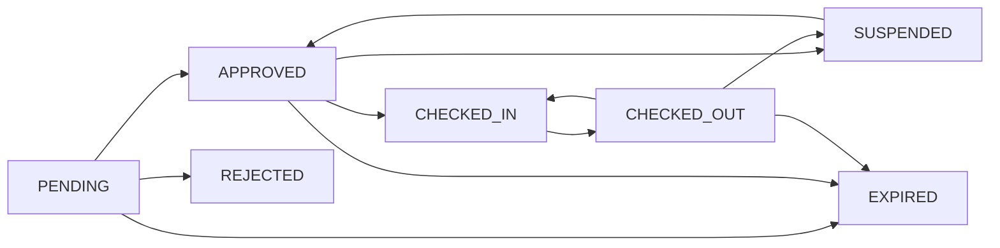
```mermaid
flowchart LR
    PENDING["PENDING"] --> APPROVED["APPROVED"]
    PENDING --> REJECTED["REJECTED"]
    PENDING --> EXPIRED["EXPIRED"]
    APPROVED --> CHECKEDIN["CHECKED_IN"]
    APPROVED --> EXPIRED
    CHECKEDIN --> CHECKEDOUT["CHECKED_OUT"]
    CHECKEDOUT --> CHECKEDIN
    APPROVED --> SUSPENDED["SUSPENDED"]
    CHECKEDOUT --> SUSPENDED
    SUSPENDED --> APPROVED
    CHECKEDOUT --> EXPIRED
```

#### Walk-In Visitor

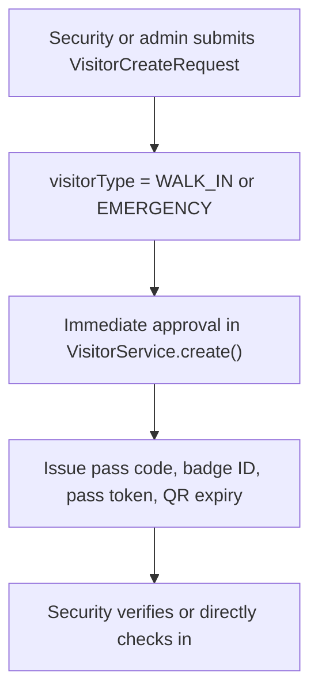
```mermaid
flowchart TD
    Desk["Security or admin submits VisitorCreateRequest"] --> Type["visitorType = WALK_IN or EMERGENCY"]
    Type --> AutoApprove["Immediate approval in VisitorService.create()"]
    AutoApprove --> Pass["Issue pass code, badge ID, pass token, QR expiry"]
    Pass --> Verify["Security verifies or directly checks in"]
```

Implementation notes:

- Immediate-access visitors are approved at registration time.
- A visitor photo is required in these internal registration flows.

#### Pre-Approved Visitor

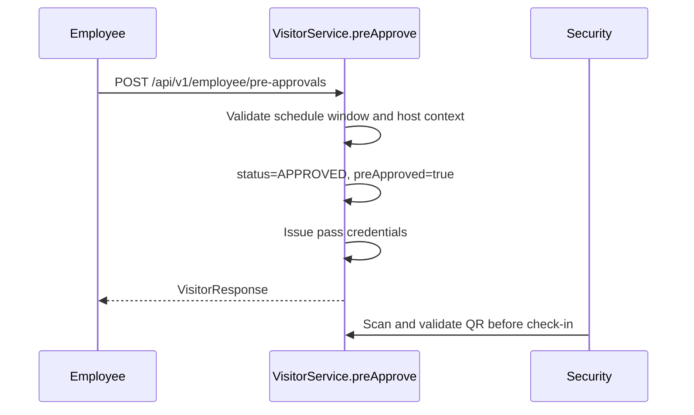
```mermaid
sequenceDiagram
    participant Employee
    participant API as VisitorService.preApprove
    participant Security

    Employee->>API: POST /api/v1/employee/pre-approvals
    API->>API: Validate schedule window and host context
    API->>API: status=APPROVED, preApproved=true
    API->>API: Issue pass credentials
    API-->>Employee: VisitorResponse
    Security->>API: Scan and validate QR before check-in
```

#### Walk-In Or Self-Service Request

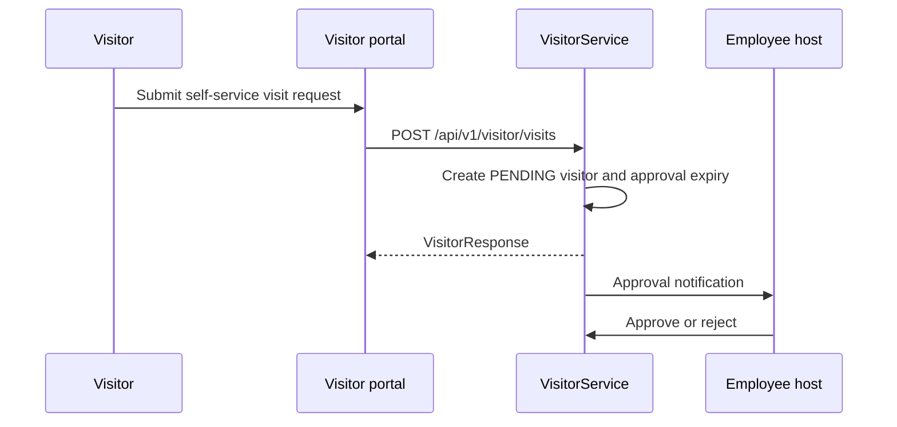
```mermaid
sequenceDiagram
    participant Visitor
    participant Portal as Visitor portal
    participant API as VisitorService
    participant Host as Employee host

    Visitor->>Portal: Submit self-service visit request
    Portal->>API: POST /api/v1/visitor/visits
    API->>API: Create PENDING visitor and approval expiry
    API-->>Portal: VisitorResponse
    API->>Host: Approval notification
    Host->>API: Approve or reject
```

#### Recurring Visitor

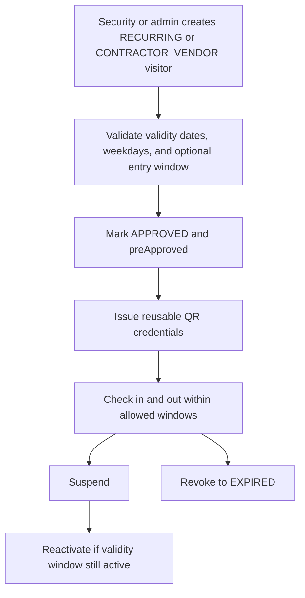
```mermaid
flowchart TD
    Create["Security or admin creates RECURRING or CONTRACTOR_VENDOR visitor"] --> Validate["Validate validity dates, weekdays, and optional entry window"]
    Validate --> Approve["Mark APPROVED and preApproved"]
    Approve --> Pass["Issue reusable QR credentials"]
    Pass --> Use["Check in and out within allowed windows"]
    Use --> Suspend["Suspend"]
    Use --> Revoke["Revoke to EXPIRED"]
    Suspend --> Reactivate["Reactivate if validity window still active"]
```

#### Approval And Rejection

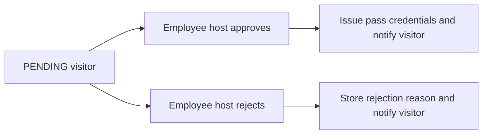
```mermaid
flowchart LR
    Pending["PENDING visitor"] --> Approve["Employee host approves"]
    Pending --> Reject["Employee host rejects"]
    Approve --> Pass["Issue pass credentials and notify visitor"]
    Reject --> Denied["Store rejection reason and notify visitor"]
```

#### Rescheduling

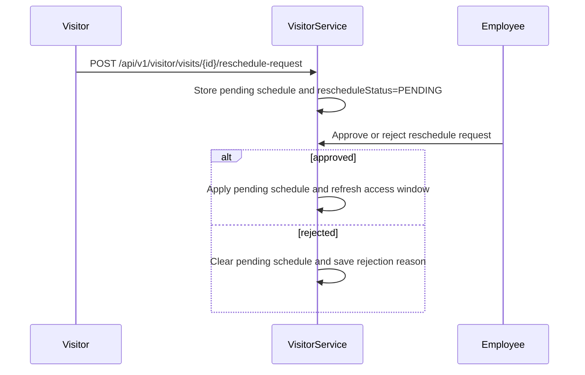
```mermaid
sequenceDiagram
    participant Visitor
    participant API as VisitorService
    participant Host as Employee

    Visitor->>API: POST /api/v1/visitor/visits/{id}/reschedule-request
    API->>API: Store pending schedule and rescheduleStatus=PENDING
    Host->>API: Approve or reject reschedule request
    alt approved
        API->>API: Apply pending schedule and refresh access window
    else rejected
        API->>API: Clear pending schedule and save rejection reason
    end
```

#### QR Generation

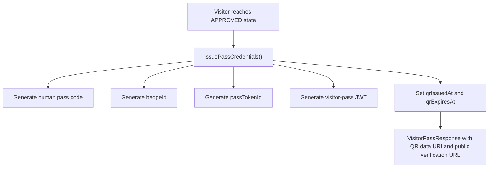
```mermaid
flowchart TD
    Approved["Visitor reaches APPROVED state"] --> Issue["issuePassCredentials()"]
    Issue --> PassCode["Generate human pass code"]
    Issue --> Badge["Generate badgeId"]
    Issue --> Token["Generate passTokenId"]
    Issue --> VisitorJwt["Generate visitor-pass JWT"]
    Issue --> Expiry["Set qrIssuedAt and qrExpiresAt"]
    Expiry --> Response["VisitorPassResponse with QR data URI and public verification URL"]
```

#### QR Validation

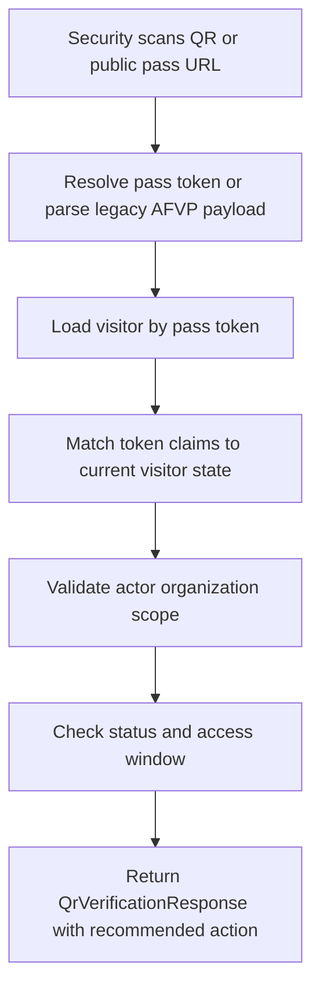
```mermaid
flowchart TD
    Scan["Security scans QR or public pass URL"] --> Resolve["Resolve pass token or parse legacy AFVP payload"]
    Resolve --> Load["Load visitor by pass token"]
    Load --> Claims["Match token claims to current visitor state"]
    Claims --> Org["Validate actor organization scope"]
    Org --> Window["Check status and access window"]
    Window --> Result["Return QrVerificationResponse with recommended action"]
```

### Employee / Workforce Flows

#### Security-Assisted Onboarding

```mermaid
sequenceDiagram
    participant Guard as Security guard
    participant API as WorkforceOnboardingService
    participant Admin as Admin

    Guard->>API: POST /api/v1/security/workforce-onboarding
    API->>API: Create EMPLOYEE account
    API->>API: active=false, accountStatus=PENDING_APPROVAL
    API-->>Guard: AdminUserResponse
    Admin->>API: GET /api/v1/admin/workforce-onboarding
```

#### Admin Approval Workflow

```mermaid
flowchart TD
    Pending["PENDING_APPROVAL worker"] --> Update["Admin may update department, role details, shifts"]
    Update --> Decision["Approve or reject"]
    Decision -->|approve| Activate["Set active=true and accountStatus=ACTIVE"]
    Decision -->|reject| Reject["Set active=false and accountStatus=REJECTED"]
    Activate --> QR["Activate static employee QR"]
    Reject --> Disable["Mark QR revoked if present"]
```

#### Static QR Activation

```mermaid
flowchart TD
    Approved["Approved employee account"] --> Provision["provisionEmployeeCredential()"]
    Provision --> EmployeeId["Generate employeeId if missing"]
    Provision --> Token["Generate employeeQrToken if missing"]
    Provision --> Shift["Backfill default shift values if missing"]
    Shift --> Active["employeeQrIssuedAt set and employeeQrRevokedAt cleared"]
```

#### Employee Check-In / Check-Out

```mermaid
flowchart TD
    Scan["Security scans ACCESSFLOW_EMPLOYEE payload"] --> Resolve["Resolve employee by employeeQrToken"]
    Resolve --> Access["Validate role=EMPLOYEE, active=true, accountStatus=ACTIVE, QR not revoked"]
    Access --> State{"Currently checked in?"}
    State -->|no| In["Create or reuse daily attendance log, mark IN"]
    State -->|yes| Out["Load latest IN log and mark OUT"]
```

#### Manual Override Workflow

```mermaid
flowchart LR
    Guard["Security guard"] --> Reason["Provide required reason"]
    Reason --> In["PATCH /api/v1/security/employees/{id}/check-in"]
    Reason --> Out["PATCH /api/v1/security/employees/{id}/check-out"]
    In --> Audit["Access audit log"]
    Out --> Audit
```

### Security Flows

#### Visitor Verification

```mermaid
flowchart TD
    Badge["Visitor badge or pass URL scan"] --> Verify["POST /api/v1/security/qr-verification"]
    Verify --> Decision{"Result"}
    Decision -->|canCheckIn| CheckIn["POST /api/v1/security/qr-check-in"]
    Decision -->|canCheckOut| CheckOut["PATCH /api/v1/security/visitors/{id}/check-out"]
    Decision -->|invalid or blocked| Escalate["Deny or escalate"]
```

#### Visitor Audit Logging

```mermaid
flowchart TD
    Create["Create, approve, reject, check in, check out, suspend, revoke, reactivate"] --> History["Append visitor status history entry"]
    History --> Audit["Write visitor_audit_logs record"]
    Audit --> Ops["Visible in history and monitoring views"]
```

#### Employee Verification

```mermaid
flowchart TD
    EmployeeQr["Static employee QR scan"] --> Attendance["POST /api/v1/security/employees/qr-scan"]
    Attendance --> Validate["Validate same org or super-admin scope"]
    Validate --> Toggle["Check in or out"]
    Toggle --> Audit["Record employee attendance audit"]
```

### Admin Flows

#### Organization Admin Workspace

```mermaid
flowchart TD
    Admin["ADMIN portal"] --> Users["Create and manage org users"]
    Admin --> Departments["Create, rename, and toggle departments"]
    Admin --> Workforce["Review workforce onboarding queue"]
    Admin --> Visitors["Search and operate visitor records"]
    Admin --> Reports["Open reports and attendance analytics"]
```

#### Department Management

```mermaid
flowchart TD
    Admin["Admin submits department request"] --> Resolve["DepartmentService resolves org scope"]
    Resolve --> Unique["Enforce organizationId + normalizedName uniqueness"]
    Unique --> Save["Create, reactivate, rename, or toggle active status"]
```

### Super Admin Flows

#### Organization Management

```mermaid
flowchart TD
    Super["SUPER_ADMIN portal"] --> Org["Create or update organizations"]
    Super --> Workspace["Open platform workspace summaries"]
    Super --> Homepage["Manage homepage settings"]
    Super --> Monitoring["View platform monitoring"]
```

#### OTP-Based Super Admin Creation

```mermaid
flowchart TD
    Super["Existing SUPER_ADMIN"] --> Start["POST /api/v1/admin/super-admins/otp"]
    Start --> Otp["Create OTP challenge in super_admin_creation_otps"]
    Otp --> Submit["POST /api/v1/admin/super-admins"]
    Submit --> Verify["Verify OTP, password confirmation, and actor eligibility"]
    Verify --> Create["Create new SUPER_ADMIN account"]
```

### Frontend Runtime Flows

#### Module Loading

```mermaid
flowchart TD
    Html["Entry HTML loads"] --> Boot["assets/js/boot.js"]
    Boot --> Env["Sync env.js runtime values"]
    Env --> Runtime["bootstrapApplication()"]
    Runtime --> Boundary["initAppErrorBoundary()"]
    Boundary --> Role["requireRole() when protected"]
    Role --> Module["Load portal module"]
    Module --> Ready["markReady()"]
```

#### Version Checking

```mermaid
flowchart TD
    Start["Runtime starts"] --> Stored["Read accessflow.runtime.version"]
    Stored --> Match{"Matches current APP_VERSION?"}
    Match -->|yes| Keep["Keep session and continue"]
    Match -->|no| Recover["recover('deployment-update')"]
```

#### Stale Cache Recovery

```mermaid
flowchart TD
    Error["Resource load error or stale import error"] --> Detect["Recoverable?"]
    Detect -->|yes| Clear["Clear accessflow.* runtime storage"]
    Clear --> Reload["Reload current page"]
    Detect -->|no| Toast["Show non-fatal toast"]
```

#### SPA And Runtime Refresh Handling

```mermaid
flowchart TD
    Focus["Window focus or visibility change"] --> Poll["Check manifest and runtime env"]
    Poll --> ApiConfig["validateApiConfiguration()"]
    ApiConfig -->|fallback used| Notice["Show recovery notice"]
    ApiConfig -->|valid| Continue["Keep current portal state"]
```

## C. File And Folder Structure

### Frontend Structure

```text
frontend/
├─ index.html
├─ assets/
│  ├─ branding/
│  └─ js/
│     ├─ boot.js
│     └─ env.js
├─ css/
│  ├─ admin/
│  ├─ employee/
│  ├─ pass/
│  ├─ security/
│  ├─ shared/
│  └─ visitor/
├─ js/
│  ├─ admin/
│  │  ├─ dashboard.js
│  │  └─ portalProfiles.js
│  ├─ employee/dashboard.js
│  ├─ pass/verify.js
│  ├─ security/dashboard.js
│  ├─ shared/
│  │  ├─ appErrorBoundary.js
│  │  ├─ appRuntime.js
│  │  ├─ authApi.js
│  │  ├─ badgeStudio.js
│  │  ├─ config.js
│  │  ├─ departmentApi.js
│  │  ├─ employeeBadgeStudio.js
│  │  ├─ employeeDirectoryApi.js
│  │  ├─ healthApi.js
│  │  ├─ homepageApi.js
│  │  ├─ hostPicker.js
│  │  ├─ httpClient.js
│  │  ├─ notificationApi.js
│  │  ├─ organizationApi.js
│  │  ├─ portalShell.js
│  │  ├─ roleGuard.js
│  │  ├─ session.js
│  │  ├─ toast.js
│  │  └─ visitorModule.js
│  ├─ visitor/dashboard.js
│  ├─ auth.js
│  ├─ emailVerification.js
│  └─ passwordReset.js
├─ pages/
│  ├─ admin/index.html
│  ├─ employee/index.html
│  ├─ forgot-password/index.html
│  ├─ pass/index.html
│  ├─ reset-password/index.html
│  ├─ security/index.html
│  ├─ verify-email/index.html
│  ├─ verify-otp/index.html
│  └─ visitor/index.html
└─ scripts/build-static.mjs
```

### Backend Structure

```text
backend/
├─ Dockerfile
├─ pom.xml
└─ src/
   ├─ main/
   │  ├─ java/com/visitor/management/
   │  │  ├─ config/
   │  │  ├─ controller/
   │  │  ├─ dto/
   │  │  ├─ entity/
   │  │  ├─ exception/
   │  │  ├─ repository/
   │  │  ├─ security/
   │  │  ├─ service/
   │  │  └─ validation/
   │  └─ resources/
   │     ├─ application.yml
   │     ├─ application-local.yml
   │     ├─ application-prod.yml
   │     └─ logback-spring.xml
   └─ test/
      ├─ java/com/visitor/management/
      └─ resources/application-test.yml
```

### Responsibilities

| Area | Responsibility |
| --- | --- |
| `frontend/assets/js` | runtime bootstrap, version polling, generated env injection |
| `frontend/js/shared` | session, auth, HTTP, role guards, shell behavior, shared API clients, runtime recovery |
| `frontend/js/admin` | admin workspace orchestration and admin-only route rendering |
| `frontend/js/employee` | employee dashboard data loading, approvals, badge and profile workflows |
| `frontend/js/security` | front-desk operations, QR verification, queue and monitoring workflows |
| `frontend/js/visitor` | visitor self-service requests, history, pass access |
| `frontend/pages` | HTML entry points consumed by Render route rewrites |
| `backend/controller` | HTTP endpoints grouped by portal or domain |
| `backend/service` | business rules, org scoping, lifecycle transitions, notifications, QR logic |
| `backend/repository` | Spring Data MongoDB persistence |
| `backend/entity` | MongoDB documents and enums |
| `backend/dto` | validated requests and shaped responses |
| `backend/security` | route authorization, JWT parsing, auth failure handling |
| `backend/config` | startup validation, indexes, CORS, cache, OpenAPI, deployment logging |

### Layer Relationships

```mermaid
flowchart TD
    Html["HTML entry point"] --> Js["portal JS module"]
    Js --> Shared["shared runtime + session + API helpers"]
    Shared --> Api["controller endpoints"]
    Api --> Service["service layer"]
    Service --> Repo["repositories"]
    Repo --> Mongo["MongoDB"]
```

## D. Frontend Architecture

### SPA Lifecycle

AccessFlow is not a React or Vue SPA. It is a static multi-entry application that behaves like an SPA inside each portal shell.

Startup path:

1. Entry HTML loads CSS, `assets/js/boot.js`, `assets/js/env.js`, and the page module.
2. `boot.js` installs the runtime, syncs `env.js`, and checks the deployment manifest.
3. `bootstrapApplication()` validates version state and API configuration.
4. `initAppErrorBoundary()` wires global runtime recovery.
5. Protected portals call `requireRole()` to restore and validate session state.
6. The page module initializes the shell and loads dashboard-specific data.

### Auth And Session Handling

- Session storage key: `visitor_management_session`
- Session persistence logic: `frontend/js/shared/session.js`
- Access token attachment and one-time refresh retry: `frontend/js/shared/httpClient.js`
- Portal redirects and stale-role handling: `frontend/js/shared/roleGuard.js`
- Logout flow: `frontend/js/shared/portalShell.js`

Key behaviors:

- Stored auth payloads are normalized on read and on write.
- Roles are merged from API response roles and JWT claims.
- `SUPER_ADMIN` is treated as effectively valid for admin surfaces.
- A mismatch between stored roles and token roles clears the session and triggers recovery.

### Dashboard Architecture

- Admin portal is path-routed and includes separate views such as dashboard, platform analytics, users, organizations, departments, reports, monitoring, and visitor access.
- Employee, security, and visitor portals are shell-based dashboards with section-driven content and shared topbar/sidebar behavior.
- Shared APIs and UI helpers keep repeated behavior out of the portal modules.

### Routing And Navigation

Render route rewrites:

- `/` and `/login` -> `frontend/index.html`
- `/admin` and `/admin/*` -> `frontend/pages/admin/index.html`
- `/employee` and `/employee/*` -> `frontend/pages/employee/index.html`
- `/security` and `/security/*` -> `frontend/pages/security/index.html`
- `/forgot-password` -> `frontend/pages/forgot-password/index.html`
- `/verify-otp` -> `frontend/pages/verify-otp/index.html`
- `/verify-email` -> `frontend/pages/verify-email/index.html`
- `/pass/*` and `/verify/*` -> `frontend/pages/pass/index.html`
- `/reset-password` -> `frontend/pages/reset-password/index.html`

Portal destination constants in `config.js`:

- `SUPER_ADMIN` -> `/admin/platform-analytics`
- `ADMIN` -> `/admin/dashboard`
- `EMPLOYEE` -> `/employee`
- `SECURITY_GUARD` -> `/security`
- `VISITOR` -> `/pages/visitor/index.html`

### Runtime Recovery System

The runtime recovery stack is split across:

- `boot.js`: deployment checks, manifest polling, storage cleanup, recovery notices
- `appRuntime.js`: portal bootstrap wrapper and API config recovery
- `appErrorBoundary.js`: recoverable runtime error and resource-load handling

Recovery triggers include:

- deployment version mismatch
- failed module or stylesheet loads
- stale dynamic module imports
- stale or invalid session state
- invalid runtime API configuration on the production frontend

### Cache And Versioning System

`frontend/scripts/build-static.mjs` does the following during each build:

- requires a valid `API_BASE_URL`
- rejects localhost API targets during Render builds
- copies frontend sources into `dist/`
- writes `dist/assets/js/env.js`
- writes `dist/assets/app-manifest.json`
- stamps local HTML, JS import, and CSS import references with `?v=<assetToken>`

The runtime relies on:

- `window.APP_VERSION`
- `window.APP_ASSET_TOKEN`
- `window.APP_BUILD_TIMESTAMP`
- `window.APP_BUILD_REVISION`

## E. Backend Architecture

### Controllers

| Controller | Responsibility |
| --- | --- |
| `AuthController` | login, registration, refresh, logout, forgot password, email verification, OTP reset flow, current user |
| `OrganizationController` | public org list, accessible orgs, super-admin workspace views, org CRUD |
| `HomepageController` | public homepage data and super-admin homepage settings |
| `NotificationController` | in-app notification retrieval and read state |
| `VisitorPortalController` | visitor self-service views, requests, pass access, reschedule requests |
| `EmployeeController` | approvals, pre-approvals, own badge/profile/attendance, host-owned visitors |
| `SecurityPortalController` | QR verification, queue, badges, monitoring, workforce onboarding, employee attendance, visitor operations |
| `AdminController` | admin analytics, users, departments, workforce approval, reports, attendance analytics, visitors, super-admin creation |
| `PublicBadgeVerificationController` | public pass verification |
| `HealthController` | health, liveness, readiness |
| `VersionController` | API version metadata |

### Services

| Service | Responsibility |
| --- | --- |
| `AuthService` | login rules, refresh rotation, logout revocation, visitor registration, email verification, password reset OTP flow |
| `VisitorService` | visitor lifecycle, pass issuance, QR validation, approvals, rescheduling, monitoring, history |
| `EmployeeAttendanceService` | employee QR provisioning, badge generation, QR scans, manual check-in/check-out, attendance analytics |
| `WorkforceOnboardingService` | security-assisted onboarding, pending approval queue, admin approval and rejection |
| `AdminUserService` | user management, role updates, disable/enable, password reset, super-admin creation OTP flow |
| `OrganizationService` | org listing, accessible scope, workspace views, org creation and updates |
| `DepartmentService` | department CRUD and org-scoped resolution |
| `HomepageService` | public homepage composition and admin settings updates |
| `NotificationService` and dispatchers | in-app notifications and email delivery |
| `AccessAuditService` | access and workforce audit trail writes |

### Repositories

Repositories use Spring Data MongoDB for:

- direct document reads and writes
- unique lookups for email, username, company code, pass token, QR token, and worker queues
- list views for org-scoped and role-scoped dashboards

`VisitorService` also uses `MongoTemplate` for richer search and monitoring queries.

### DTO Flow

```mermaid
flowchart LR
    Request["validated request DTO"] --> Controller["controller method"]
    Controller --> Service["service method"]
    Service --> Entity["entity load or mutation"]
    Entity --> Repo["repository save or query"]
    Repo --> Response["response DTO or ApiResponse<T>"]
```

Response conventions:

- most endpoints return `ApiResponse<T>`
- paginated endpoints wrap `PageResponse<T>` inside `ApiResponse`
- login returns raw `AuthResponse`

### RBAC Enforcement

Enforcement happens in layers:

1. `SecurityConfig` route families
2. `@PreAuthorize` for stricter controller rules
3. `JwtAuthenticationFilter` for current-user validation
4. service-layer organization and lifecycle checks

Examples:

- `/api/v1/admin/**` requires `ADMIN` or `SUPER_ADMIN`
- `/api/v1/security/**` requires `SECURITY_GUARD`
- `/api/v1/employee/**` requires `EMPLOYEE`
- `/api/v1/visitor/**` requires `VISITOR`
- some admin endpoints such as super-admin creation, monitoring, and homepage settings require `SUPER_ADMIN` specifically

### Organization Isolation

Organization isolation is enforced through:

- company code validation during login for org-bound users
- active organization resolution in auth and visitor creation flows
- service checks like `requireOrganizationAccess()` and `requireSameOrganizationOrSuperAdmin()`
- admin and security scoping to `organizationId` unless the actor is `SUPER_ADMIN`

### Audit Logging

- `access_audit_logs` captures auth, workforce, organization, and attendance events
- `visitor_audit_logs` captures visitor status transitions and operational notes
- visitor entities also keep inline `statusHistory` entries for timeline rendering

### QR Validation Logic

Visitor QR logic:

- accepts public pass URLs, pass tokens, and legacy `AFVP:` payloads
- validates token claims against the current visitor record
- verifies org scope, status, pass freshness, and access window
- returns a structured `QrVerificationResponse` with `valid`, `recognized`, `resultCode`, `recommendedAction`, and check-in/check-out flags

Employee QR logic:

- expects `ACCESSFLOW_EMPLOYEE:<organizationId>:<employeeId>:<employeeQrToken>`
- resolves the employee by `employeeQrToken`
- rejects revoked or inactive credentials
- toggles attendance state based on whether an open `IN` log exists

## F. Database Design

### Collection Relationships

```mermaid
erDiagram
    ORGANIZATIONS ||--o{ USERS : organizationId
    ORGANIZATIONS ||--o{ DEPARTMENTS : organizationId
    ORGANIZATIONS ||--o{ VISITORS : organizationId
    USERS ||--o{ REFRESH_TOKENS : userId
    USERS ||--o{ PASSWORD_RESET_TOKENS : userId
    USERS ||--o{ NOTIFICATIONS : recipientUserId
    USERS ||--o{ EMPLOYEE_ATTENDANCE_LOGS : employeeUserId
    USERS ||--o{ ACCESS_AUDIT_LOGS : actorId
    USERS ||--o{ SUPER_ADMIN_CREATION_OTPS : actorUserId
    VISITORS ||--o{ VISITOR_AUDIT_LOGS : visitorId
```

### Collections

| Collection | Purpose |
| --- | --- |
| `users` | visitor and internal accounts, org context, roles, workforce QR credentials, verification state |
| `organizations` | tenant root records |
| `departments` | org-scoped department directory |
| `visitors` | visitor lifecycle, schedule, host, recurring rules, pass state, badge data |
| `employee_attendance_logs` | employee presence and manual override history |
| `notifications` | in-app notification queue and read state |
| `access_audit_logs` | auth, account, org, workforce, and attendance audit events |
| `visitor_audit_logs` | visitor-specific lifecycle transitions |
| `refresh_tokens` | hashed refresh-token records with revoke state |
| `password_reset_tokens` | OTP verification and reset-token flow state |
| `super_admin_creation_otps` | OTP flow for creating new super admins |
| `homepage_settings` | super-admin-managed public homepage presentation settings |

### Important Fields

`users` highlights:

- identity: `email`, `username`, `fullName`
- org scope: `organizationId`, `organizationCode`, `organizationName`
- roles: `roles`
- workforce: `employeeId`, `employeeQrToken`, shift fields, onboarding audit fields
- auth state: `active`, `accountStatus`, `passwordChangedAt`, email verification fields

`visitors` highlights:

- identity: `fullName`, `phone`, `email`, `companyName`
- routing: `organizationId`, `hostEmployeeId`, `hostEmployeeDepartment`
- scheduling: `scheduledStartTime`, `scheduledEndTime`, `accessWindowStartTime`, `accessWindowEndTime`
- recurring controls: `validityStartDate`, `validityEndDate`, `allowedWeekdays`, entry windows
- lifecycle: `status`, `preApproved`, approval and rejection metadata
- badge state: `qrCode`, `badgeId`, `passTokenId`, `qrIssuedAt`, `qrExpiresAt`

### Indexes

Entity-level indexes:

- `users`: unique email, unique sparse username, sparse employee ID, unique sparse employee QR token, org fields, sparse email verification token hash
- `organizations`: indexed `companyName`, unique `companyCode`, indexed `activeStatus`
- `departments`: unique compound index on `organizationId + normalizedName`
- `visitors`: indexes on search fields, org scope, host, schedule fields, status, and unique sparse QR/badge/pass identifiers
- `employee_attendance_logs`: indexes on employee, org, and attendance date
- `notifications`: recipient and read-state indexes
- `refresh_tokens`, `password_reset_tokens`, `super_admin_creation_otps`: token lookup indexes

Startup-created indexes in `MongoIndexConfig`:

- visitor host/status/created index
- visitor org/status/created index
- visitor org/type/validity index
- visitor org/status/check-out index
- notification recipient/read/created index
- visitor audit visitor/created index
- access audit action/created index
- attendance org/date/state index
- attendance employee/check-in index
- TTL index on `super_admin_creation_otps.expiresAt`

### Workforce And Visitor Lifecycle States

Visitor states:

| State | Meaning |
| --- | --- |
| `PENDING` | waiting for host decision |
| `APPROVED` | approved and pass-ready |
| `REJECTED` | denied |
| `CHECKED_IN` | currently on site |
| `CHECKED_OUT` | departed |
| `EXPIRED` | pass or profile no longer usable |
| `SUSPENDED` | recurring profile temporarily blocked |

Account statuses:

| Status | Meaning |
| --- | --- |
| `ACTIVE` | active usable account |
| `UNVERIFIED` | visitor registered but email not verified yet |
| `PENDING_APPROVAL` | workforce account awaiting admin approval |
| `REJECTED` | workforce request denied |
| `DISABLED` | internal account disabled |
| `LOCKED` | enum exists for account lock scenarios |

## G. RBAC Matrix

| Role | Key permissions | Key restrictions | Hidden UI behavior | Backend enforcement |
| --- | --- | --- | --- | --- |
| `SUPER_ADMIN` | platform analytics, org CRUD, homepage settings, monitoring, super-admin creation | none beyond authenticated platform rules | full admin workspace visible | admin route access plus super-admin-specific `@PreAuthorize` checks |
| `ADMIN` | org users, departments, workforce approval, visitor operations, reports, attendance analytics | cannot use super-admin-only org management, monitoring, homepage settings, or create super admins | platform-only nav items omitted | route family + admin-only service checks + org scope |
| `SECURITY_GUARD` | QR verification, visitor queue, monitoring, workforce intake, employee attendance scan, manual presence overrides | no admin or employee management surfaces | only security workspace shown | `/api/v1/security/**` + same-org checks + override reason rules |
| `EMPLOYEE` | host approvals, pre-approvals, own profile, own badge, own attendance, host-owned visitors | no security desk or admin surfaces | only employee workspace shown | `/api/v1/employee/**` + host ownership checks |
| `VISITOR` | registration, visit requests, history, reschedule requests, approved pass access | no internal portal access | visitor-only login/register/pass flows | `/api/v1/visitor/**` + visitor email/org checks |

Additional RBAC notes:

- `SUPER_ADMIN` is treated as effectively allowed on admin portal routing in the frontend.
- Frontend hiding is only a convenience layer.
- Backend authority comes from `SecurityConfig`, `@PreAuthorize`, `JwtAuthenticationFilter`, organization checks, and lifecycle validation.
- Admins cannot create or elevate super admins through standard admin user management routes.

## H. API Documentation

### Response Shapes

- Standard envelope: `ApiResponse<T>`
- Pagination envelope: `ApiResponse<PageResponse<T>>`
- Auth login response: raw `AuthResponse`

Representative `ApiResponse<T>` shape:

```json
{
  "success": true,
  "message": "Operation completed.",
  "data": {},
  "timestamp": "2026-05-16T09:30:00Z"
}
```

### Public And Auth Endpoints

| Method | Path | Auth | Roles | Summary |
| --- | --- | --- | --- | --- |
| `POST` | `/api/v1/auth/login` | No | Public | sign in with identifier/email, password, audience, optional company code |
| `POST` | `/api/v1/auth/register` | No | Public | visitor account registration |
| `POST` | `/api/v1/auth/refresh` | No | refresh token | rotate refresh token and issue new access token |
| `POST` | `/api/v1/auth/logout` | No | refresh token | revoke a refresh token |
| `POST` | `/api/v1/auth/forgot-password` | No | Public | start password reset OTP flow |
| `POST` | `/api/v1/auth/resend-verification` | No | Public | resend visitor verification email |
| `GET` | `/api/v1/auth/verify-email` | No | Public | verify visitor email token |
| `POST` | `/api/v1/auth/verify-otp` | No | Public | validate OTP and return reset token |
| `POST` | `/api/v1/auth/reset-password` | No | Public | set a new password |
| `GET` | `/api/v1/auth/me` | Yes | any authenticated role | current user profile |
| `GET` | `/api/v1/health` | No | Public | basic health |
| `GET` | `/api/v1/health/live` | No | Public | liveness probe |
| `GET` | `/api/v1/health/ready` | No | Public | readiness probe with Mongo ping |
| `GET` | `/api/versions` | No | Public | API version metadata |
| `GET` | `/api/v1/public/passes/{token}` | No | Public | public pass verification |
| `GET` | `/api/v1/homepage` | No | Public | public homepage data |
| `GET` | `/api/v1/organizations/public` | No | Public | active organizations for signup/login selection |

### Organization, Homepage, And Notifications

| Method | Path | Roles | Summary |
| --- | --- | --- | --- |
| `GET` | `/api/v1/organizations` | `ADMIN`, `SUPER_ADMIN` | list accessible organizations |
| `GET` | `/api/v1/organizations/workspace` | `SUPER_ADMIN` | platform workspace summaries |
| `GET` | `/api/v1/organizations/{id}/workspace` | `SUPER_ADMIN` | workspace detail |
| `POST` | `/api/v1/organizations` | `SUPER_ADMIN` | create organization |
| `PUT` | `/api/v1/organizations/{id}` | `SUPER_ADMIN` | update organization |
| `GET` | `/api/v1/homepage/settings` | `SUPER_ADMIN` | read homepage settings |
| `PUT` | `/api/v1/homepage/settings` | `SUPER_ADMIN` | update homepage settings |
| `GET` | `/api/v1/notifications` | any authenticated role | read latest notifications |
| `PATCH` | `/api/v1/notifications/{id}/read` | notification recipient | mark one notification read |
| `PATCH` | `/api/v1/notifications/read-all` | notification recipient | mark all notifications read |

### Visitor Portal Endpoints

| Method | Path | Roles | Summary |
| --- | --- | --- | --- |
| `GET` | `/api/v1/visitor/overview` | `VISITOR` | visitor dashboard summary |
| `GET` | `/api/v1/visitor/visits` | `VISITOR` | current and recent visits |
| `GET` | `/api/v1/visitor/history` | `VISITOR` | historical visit summary |
| `GET` | `/api/v1/visitor/hosts` | `VISITOR` | searchable host list |
| `POST` | `/api/v1/visitor/visits` | `VISITOR` | create self-service visit request |
| `POST` | `/api/v1/visitor/visits/photo` | `VISITOR` | upload visitor photo |
| `GET` | `/api/v1/visitor/visits/{id}/pass` | `VISITOR` | fetch approved pass |
| `POST` | `/api/v1/visitor/visits/{id}/reschedule-request` | `VISITOR` | request a schedule change |

### Employee Endpoints

| Method | Path | Roles | Summary |
| --- | --- | --- | --- |
| `GET` | `/api/v1/employee/overview` | `EMPLOYEE` | employee dashboard metrics |
| `GET` | `/api/v1/employee/approvals` | `EMPLOYEE` | pending host approvals |
| `GET` | `/api/v1/employee/pre-approvals` | `EMPLOYEE` | upcoming pre-approved visitors |
| `POST` | `/api/v1/employee/pre-approvals` | `EMPLOYEE` | create pre-approved visitor |
| `GET` | `/api/v1/employee/notifications` | `EMPLOYEE` | employee notifications view |
| `GET` | `/api/v1/employee/attendance` | `EMPLOYEE` | own attendance logs |
| `GET` | `/api/v1/employee/badge` | `EMPLOYEE` | own badge and static QR |
| `GET` | `/api/v1/employee/profile` | `EMPLOYEE` | own profile |
| `PATCH` | `/api/v1/employee/profile` | `EMPLOYEE` | update own profile |
| `PATCH` | `/api/v1/employee/profile/password` | `EMPLOYEE` | update own password |
| `POST` | `/api/v1/employee/profile/photo` | `EMPLOYEE` | upload own photo |
| `GET` | `/api/v1/employee/scheduled-visitors` | `EMPLOYEE` | scheduled visitors view |
| `GET` | `/api/v1/employee/history` | `EMPLOYEE` | host-related visitor history |
| `GET` | `/api/v1/employee/visitors` | `EMPLOYEE` | list host-owned visitors |
| `GET` | `/api/v1/employee/visitors/{id}` | `EMPLOYEE` | get one host-owned visitor |
| `POST` | `/api/v1/employee/visitors` | `EMPLOYEE` | create visitor under host context |
| `PATCH` | `/api/v1/employee/visitors/{id}/approve` | `EMPLOYEE` | approve pending visitor |
| `PATCH` | `/api/v1/employee/visitors/{id}/reject` | `EMPLOYEE` | reject pending visitor |
| `POST` | `/api/v1/employee/visitors/photo` | `EMPLOYEE` | upload visitor photo |
| `PUT` | `/api/v1/employee/visitors/{id}` | `EMPLOYEE` | update host-owned visitor |
| `PATCH` | `/api/v1/employee/visitors/{id}/reschedule` | `EMPLOYEE` | directly reschedule visitor |
| `PATCH` | `/api/v1/employee/visitors/{id}/reschedule-request/approve` | `EMPLOYEE` | approve reschedule request |
| `PATCH` | `/api/v1/employee/visitors/{id}/reschedule-request/reject` | `EMPLOYEE` | reject reschedule request |

### Security Endpoints

| Method | Path | Roles | Summary |
| --- | --- | --- | --- |
| `GET` | `/api/v1/security/overview` | `SECURITY_GUARD` | desk metrics |
| `GET` | `/api/v1/security/checkins` | `SECURITY_GUARD` | current check-ins |
| `GET` | `/api/v1/security/photo-capture` | `SECURITY_GUARD` | photo-capture metadata |
| `POST` | `/api/v1/security/qr-verification` | `SECURITY_GUARD` | verify visitor QR/pass |
| `POST` | `/api/v1/security/qr-check-in` | `SECURITY_GUARD` | QR-driven visitor check-in |
| `GET` | `/api/v1/security/badges` | `SECURITY_GUARD` | badge print queue |
| `GET` | `/api/v1/security/queue` | `SECURITY_GUARD` | live queue view |
| `GET` | `/api/v1/security/visitors` | `SECURITY_GUARD` | search visitors |
| `GET` | `/api/v1/security/monitoring` | `SECURITY_GUARD` | monitoring workspace |
| `GET` | `/api/v1/security/hosts` | `SECURITY_GUARD` | host lookup |
| `GET` | `/api/v1/security/employees` | `SECURITY_GUARD` | employee directory |
| `POST` | `/api/v1/security/workforce-onboarding` | `SECURITY_GUARD` | submit assisted workforce request |
| `POST` | `/api/v1/security/workforce-onboarding/photo` | `SECURITY_GUARD` | upload workforce photo |
| `GET` | `/api/v1/security/employees/attendance` | `SECURITY_GUARD` | attendance logs |
| `POST` | `/api/v1/security/employees/qr-scan` | `SECURITY_GUARD` | scan static employee QR |
| `GET` | `/api/v1/security/employees/{id}/badge` | `SECURITY_GUARD` | fetch employee badge |
| `PATCH` | `/api/v1/security/employees/{id}/check-in` | `SECURITY_GUARD` | manual employee check-in |
| `PATCH` | `/api/v1/security/employees/{id}/check-out` | `SECURITY_GUARD` | manual employee check-out |
| `GET` | `/api/v1/security/visitors/{id}` | `SECURITY_GUARD` | get visitor |
| `GET` | `/api/v1/security/visitors/{id}/history` | `SECURITY_GUARD` | visitor history |
| `GET` | `/api/v1/security/visitors/{id}/pass` | `SECURITY_GUARD` | visitor pass |
| `PATCH` | `/api/v1/security/visitors/{id}/badge-printed` | `SECURITY_GUARD` | mark badge printed |
| `POST` | `/api/v1/security/visitors` | `SECURITY_GUARD` | create visitor |
| `POST` | `/api/v1/security/visitors/photo` | `SECURITY_GUARD` | upload visitor photo |
| `PUT` | `/api/v1/security/visitors/{id}` | `SECURITY_GUARD` | update visitor |
| `PATCH` | `/api/v1/security/visitors/{id}/check-in` | `SECURITY_GUARD` | direct visitor check-in |
| `PATCH` | `/api/v1/security/visitors/{id}/override-check-in` | `SECURITY_GUARD` | manual override visitor check-in |
| `PATCH` | `/api/v1/security/visitors/{id}/check-out` | `SECURITY_GUARD` | visitor check-out |
| `PATCH` | `/api/v1/security/visitors/{id}/suspend` | `SECURITY_GUARD` | suspend recurring visitor |
| `PATCH` | `/api/v1/security/visitors/{id}/revoke` | `SECURITY_GUARD` | revoke recurring visitor |
| `PATCH` | `/api/v1/security/visitors/{id}/reactivate` | `SECURITY_GUARD` | reactivate recurring visitor |

### Admin Endpoints

| Method | Path | Roles | Summary |
| --- | --- | --- | --- |
| `GET` | `/api/v1/admin/overview` | `ADMIN`, `SUPER_ADMIN` | dashboard overview |
| `GET` | `/api/v1/admin/analytics` | `ADMIN`, `SUPER_ADMIN` | analytics widgets |
| `GET` | `/api/v1/admin/users` | `ADMIN`, `SUPER_ADMIN` | list users |
| `POST` | `/api/v1/admin/users` | `ADMIN`, `SUPER_ADMIN` | create internal user |
| `POST` | `/api/v1/admin/super-admins/otp` | `SUPER_ADMIN` | begin super-admin creation flow |
| `POST` | `/api/v1/admin/super-admins` | `SUPER_ADMIN` | create a new super admin |
| `PATCH` | `/api/v1/admin/users/{id}/disable` | `ADMIN`, `SUPER_ADMIN` | disable user |
| `PATCH` | `/api/v1/admin/users/{id}/enable` | `ADMIN`, `SUPER_ADMIN` | enable user |
| `PATCH` | `/api/v1/admin/users/{id}/reset-password` | `ADMIN`, `SUPER_ADMIN` | reset user password |
| `PATCH` | `/api/v1/admin/users/{id}/role` | `ADMIN`, `SUPER_ADMIN` | update role with restrictions |
| `GET` | `/api/v1/admin/departments` | `ADMIN`, `SUPER_ADMIN` | list departments |
| `POST` | `/api/v1/admin/departments` | `ADMIN`, `SUPER_ADMIN` | create or reactivate department |
| `PATCH` | `/api/v1/admin/departments/{id}` | `ADMIN`, `SUPER_ADMIN` | rename or toggle department |
| `GET` | `/api/v1/admin/reports` | `ADMIN`, `SUPER_ADMIN` | reporting dataset |
| `GET` | `/api/v1/admin/workforce-attendance` | `ADMIN`, `SUPER_ADMIN` | attendance log view |
| `GET` | `/api/v1/admin/workforce-attendance/analytics` | `ADMIN`, `SUPER_ADMIN` | attendance analytics |
| `GET` | `/api/v1/admin/workforce-onboarding` | `ADMIN`, `SUPER_ADMIN` | pending workforce queue |
| `PUT` | `/api/v1/admin/workforce-onboarding/{id}` | `ADMIN` | update pending worker |
| `PATCH` | `/api/v1/admin/workforce-onboarding/{id}/approve` | `ADMIN` | approve worker |
| `PATCH` | `/api/v1/admin/workforce-onboarding/{id}/reject` | `ADMIN` | reject worker |
| `GET` | `/api/v1/admin/monitoring` | `SUPER_ADMIN` | platform monitoring |
| `GET` | `/api/v1/admin/homepage-settings` | `SUPER_ADMIN` | homepage settings via admin surface |
| `PUT` | `/api/v1/admin/homepage-settings` | `SUPER_ADMIN` | update homepage settings via admin surface |
| `GET` | `/api/v1/admin/visitors` | `ADMIN`, `SUPER_ADMIN` | search visitors |
| `GET` | `/api/v1/admin/visitors/{id}` | `ADMIN`, `SUPER_ADMIN` | get visitor |
| `POST` | `/api/v1/admin/visitors` | `ADMIN`, `SUPER_ADMIN` | create visitor |
| `POST` | `/api/v1/admin/visitors/photo` | `ADMIN`, `SUPER_ADMIN` | upload visitor photo |
| `PUT` | `/api/v1/admin/visitors/{id}` | `ADMIN`, `SUPER_ADMIN` | update visitor |
| `PATCH` | `/api/v1/admin/visitors/{id}/check-in` | `ADMIN`, `SUPER_ADMIN` | check in visitor |
| `PATCH` | `/api/v1/admin/visitors/{id}/check-out` | `ADMIN`, `SUPER_ADMIN` | check out visitor |
| `DELETE` | `/api/v1/admin/visitors/{id}` | `ADMIN`, `SUPER_ADMIN` | delete visitor |

### Request Examples

Login request:

```json
{
  "identifier": "security_guard_01",
  "password": "StrongPassword!123",
  "companyCode": "ACME",
  "portalAudience": "security"
}
```

Visitor creation request:

```json
{
  "fullName": "Ravi Patel",
  "phoneCountryCode": "+91",
  "phone": "9876543210",
  "email": "ravi@example.com",
  "companyCode": "ACME",
  "purposeOfVisit": "Vendor meeting",
  "hostEmployeeId": "employee-123",
  "photoUrl": "https://res.cloudinary.com/.../visitor.jpg",
  "photoPublicId": "accessflow/visitors/visitor-123",
  "scheduledStartTime": "2026-05-20T04:30:00Z",
  "scheduledEndTime": "2026-05-20T05:30:00Z",
  "timezone": "Asia/Kolkata",
  "visitorType": "ONE_TIME"
}
```

QR verification request:

```json
{
  "qrPayload": "https://accessflow-web.onrender.com/pass/550e8400-e29b-41d4-a716-446655440000"
}
```

Workforce onboarding request:

```json
{
  "fullName": "Sanjay Kumar",
  "department": "Facilities",
  "phoneCountryCode": "+91",
  "phone": "9999999999",
  "designation": "Support staff",
  "employeeType": "SUPPORT_STAFF",
  "shiftName": "Morning Shift",
  "shiftStartTime": "09:00",
  "shiftEndTime": "18:00",
  "employeePhotoUrl": "https://res.cloudinary.com/.../worker.jpg"
}
```

Manual employee override request:

```json
{
  "reason": "Scanner offline at east gate"
}
```

Representative QR verification response:

```json
{
  "valid": true,
  "recognized": true,
  "resultCode": "VALID_PASS",
  "headline": "Pass verified",
  "recommendedAction": "Confirm the visitor photo and identity, then complete check-in.",
  "visitorId": "6825visitor",
  "fullName": "Ravi Patel",
  "status": "APPROVED",
  "badgeId": "AFB-104928",
  "passCode": "AFP-582640",
  "canCheckIn": true,
  "canCheckOut": false
}
```

## I. Responsive Strategy

### Desktop Workflows

- Admin workflows are desktop-first and tuned for denser analytics, reporting, organization management, and long-form tables.
- Employee and security dashboards use multi-panel layouts that are most comfortable on desktop or larger tablets.
- Badge preview and operational review states are designed to benefit from wider screens.

### Mobile Workflows

- Visitor-facing flows are mobile-friendly: registration, login, email verification, OTP verification, pass access, and history views.
- Auth and password reset pages are designed for narrow screens with single-column interaction patterns.
- Portal shells collapse their navigation for smaller screens.

### Tablet And Security Workflows

- Security workflows are suited to front-desk tablets and checkpoint devices.
- QR flows support scanner-style input and camera-assisted flows where available.
- Badge verification, queue handling, and employee attendance actions stay reachable without desktop-only interactions.

### QR Scanning UX

- Visitor QR verification accepts public pass URLs and AccessFlow badge payloads.
- Employee attendance expects a static QR payload format and toggles presence state directly.
- Manual override actions exist for degraded operational cases such as scanner failure.

### Responsive Architecture

- Shared shell behavior lives in `portalShell.js`.
- Portal-specific layout rules live in separate role CSS directories.
- Runtime notices are presented as overlays that remain visible on both mobile and desktop.

## J. Deployment And Versioning

### Render Deployment

`render.yaml` defines:

- `accessflow-api-goww`
  - type: Docker web service
  - root: `backend`
  - health check: `/api/v1/health/live`
- `accessflow-web`
  - type: static web service
  - root: `frontend`
  - publish path: `dist`
  - build command: `node ./scripts/build-static.mjs`

### Frontend Deployment Lifecycle

```mermaid
flowchart TD
    Source["frontend source"] --> Clean["Delete dist"]
    Clean --> Copy["Copy workspace into dist"]
    Copy --> Env["Generate assets/js/env.js"]
    Env --> Manifest["Generate assets/app-manifest.json"]
    Manifest --> Stamp["Stamp HTML, JS imports, and CSS imports with asset token"]
    Stamp --> Publish["Publish dist to Render static site"]
```

### Backend Deployment Lifecycle

```mermaid
flowchart TD
    Source["backend source"] --> Maven["Spring Boot build"]
    Maven --> Image["Docker image from backend/Dockerfile"]
    Image --> Prod["Start with prod profile on Render"]
    Prod --> Validate["ProductionEnvironmentValidator"]
    Validate --> Indexes["MongoIndexConfig ensures indexes"]
    Indexes --> Live["Health endpoint goes live"]
```

### Frontend Versioning System

- Version format: `YYYY.MM.DD.HHMMSS`
- Asset token format: `YYYYMMDD_HHMMSS`
- Optional revision: first 12 chars from `RENDER_GIT_COMMIT` or `GIT_COMMIT`
- Runtime metadata is exposed through global variables in `env.js`

### Cache Invalidation

- HTML entry points are `no-store`
- `assets/app-manifest.json` is `no-store`
- `assets/js/env.js` is `no-store`
- `assets/js/boot.js`, `/css/*`, and `/js/*` are immutable because the build rewrites their URLs with the current asset token

### Stale Runtime Recovery

```mermaid
flowchart TD
    OpenTab["User keeps old tab open"] --> NewDeploy["New deploy publishes new manifest and assets"]
    NewDeploy --> Poll["Old tab polls manifest"]
    Poll --> Changed{"Version changed?"}
    Changed -->|no| Continue["Continue current runtime"]
    Changed -->|yes| Recover["Clear transient runtime state"]
    Recover --> Reload["Reload active route"]
    Reload --> Fresh["Fresh HTML points to fresh tokenized assets"]
```

### Production Guardrails

At startup or build time, AccessFlow guards against:

- missing `API_BASE_URL` during frontend builds
- localhost API targets during Render frontend builds
- invalid or placeholder JWT secret in production
- non-production MongoDB settings in production
- insecure or wildcard public/CORS origin configuration

### Operational Notes

- `swagger-ui.html` is available through springdoc for interactive API inspection.
- readiness checks perform a MongoDB ping and return `DEGRADED` if the database is unavailable.
- the runtime can preserve session state during deployment refreshes, but auth failures still force a clean re-login.
