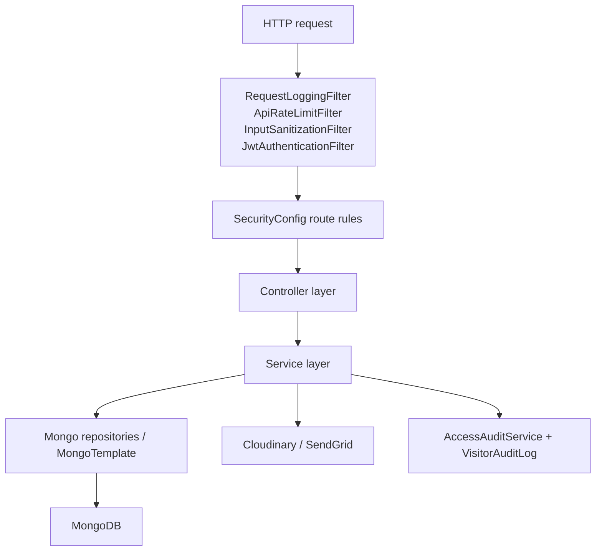

# Backend Architecture

## Backend Model

The backend is a layered Spring Boot application:

- controllers expose role-specific HTTP surfaces
- services own business rules
- repositories persist MongoDB documents
- security filters validate requests before controllers run
- scheduled and async services handle expiry and email retry work

## Backend Layer Diagram

## Controller Responsibilities

| Controller | Base path | Responsibility |
| --- | --- | --- |
| `AuthController` | `/api/v1/auth` | login, refresh, logout, register, password reset |
| `OrganizationController` | `/api/v1/organizations` | public org list, org CRUD, org workspace |
| `HomepageController` | `/api/v1/homepage` | public homepage content and super-admin homepage settings |
| `AdminController` | `/api/v1/admin` | analytics, users, departments, monitoring, visitor access, workforce approvals |
| `EmployeeController` | `/api/v1/employee` | host approvals, pre-approvals, visitor history, own badge and attendance |
| `SecurityPortalController` | `/api/v1/security` | queue, monitoring, QR verification, check-in, workforce onboarding, employee attendance |
| `VisitorPortalController` | `/api/v1/visitor` | self-service visits, history, host search, badge access, reschedule requests |
| `NotificationController` | `/api/v1/notifications` | notification list and read state |
| `PublicBadgeVerificationController` | `/api/v1/public` | public badge verification |
| `HealthController` | `/api/v1/health` | health, liveness, readiness |
| `VersionController` | `/api/versions` | API version metadata |

## Service Responsibilities

### `AuthService`

- public visitor registration
- audience-aware login
- organization code enforcement for internal accounts
- refresh-token rotation
- logout token revocation
- forgot-password OTP generation
- OTP verification
- password reset and refresh-token invalidation

### `VisitorService`

- visitor creation across every actor type
- host pre-approval flow
- self-service visitor requests
- recurring and contractor profile handling
- walk-in and emergency immediate approval
- visitor search and organization scoping
- approval and rejection
- pass issuance and regeneration
- reschedule request, approval, rejection, and host reschedule
- check-in, QR check-in, manual override, check-out
- recurring suspension, revocation, and reactivation
- QR verification logic
- visitor expiry scheduling
- monitoring and history aggregation

### `EmployeeAttendanceService`

- employee credential provisioning
- static employee QR activation and revocation
- employee badge generation
- QR-based employee check-in/out
- manual guard overrides
- attendance analytics and workforce lookup

### `WorkforceOnboardingService`

- security-assisted employee onboarding request creation
- pending approval queue
- admin update before approval
- approval and activation of employee access
- rejection and QR deactivation

### `AdminUserService`

- internal account creation
- secure SUPER_ADMIN OTP flow
- user enable/disable
- password reset
- role reassignment
- department enforcement for `ADMIN` and `SECURITY_GUARD`

### `OrganizationService`

- tenant CRUD
- active organization resolution by code or name
- organization workspace summary
- recent visitor and audit summaries

## DTO Flow

The current backend consistently uses DTOs for both request validation and response shaping.

Typical pattern:

1. Controller accepts a validated request DTO.
2. Service resolves the authenticated actor and business context.
3. Service loads or mutates entities.
4. Service maps entities to response DTOs or `ApiResponse<T>`.

Current examples:

- `AuthRequest` -> `AuthResponse`
- `VisitorCreateRequest` / `VisitorVisitRequest` -> `VisitorResponse`
- `QrVerificationRequest` -> `QrVerificationResponse`
- `WorkforceOnboardingRequest` -> `AdminUserResponse`
- `OrganizationRequest` -> `OrganizationResponse`

## RBAC Enforcement

RBAC is enforced in four layers.

1. `SecurityConfig`
   - matches `/api/v1/admin/**`, `/employee/**`, `/security/**`, `/visitor/**`
2. `@PreAuthorize`
   - narrows special cases like SUPER_ADMIN-only routes
3. `JwtAuthenticationFilter`
   - confirms the user still exists, is active, still has the claimed roles, and has not changed password since token issue
4. Service checks
   - organization scope
   - host ownership
   - lifecycle state
   - override reason requirements

## Organization Isolation

Organization isolation is implemented mostly in services, not only in route protection.

Current patterns:

- `VisitorService.search()` injects `organizationId` criteria based on the actor.
- `VisitorService.requireOrganizationAccess()` and `hasOrganizationAccess()` gate direct visitor access.
- `EmployeeAttendanceService.requireSameOrganizationOrSuperAdmin()` scopes employee access.
- `WorkforceOnboardingService.requireManagedWorker()` restricts admin approval to same-org employees.
- `DepartmentService.resolveScopedOrganization()` forces non-super-admin users into their own org.

## Audit Logging

There are two audit layers.

### `visitor_audit_logs`

Written by `VisitorService.audit()` for visitor lifecycle changes such as:

- approval
- rejection
- reschedule
- check-in/check-out
- auto-expiry
- recurring suspension/revocation/reactivation

### `access_audit_logs`

Written by `AccessAuditService` for broader security and platform events such as:

- login success and failure
- account creation
- super-admin OTP events
- role changes
- workforce onboarding actions
- employee attendance actions
- organization changes

## QR Validation Logic

Visitor pass verification is centralized in `VisitorService.verifyQrPayload()` and `evaluateVerification()`.

Current verification path:

1. Try to extract a public pass token from a verification URL.
2. Otherwise normalize the raw payload.
3. Parse a JWT-style visitor pass if present.
4. Load the visitor by `passTokenId` or fallback identifier.
5. Verify token claims against current visitor state.
6. Enforce organization match for security actor.
7. Evaluate lifecycle state:
   - pending
   - rejected
   - suspended
   - expired
   - checked in
   - checked out
   - valid recurring
   - valid one-time
8. Return a structured `QrVerificationResponse` with:
   - status headline
   - recommended action
   - visitor identity
   - access window
   - `canCheckIn`
   - `canCheckOut`

Employee QR validation is separate:

- handled by `EmployeeAttendanceService.parseQrToken()` and `scan()`
- payload format starts with `ACCESSFLOW_EMPLOYEE:`
- toggles between check-in and check-out depending on current attendance state

## Scheduling, Async, And Caching

Current backend runtime features:

- `@EnableScheduling` is enabled at application level
- `VisitorExpiryScheduler` expires pending or outdated visitors on a fixed delay
- `NotificationRetryScheduler` retries pending email delivery
- `@EnableAsync` is enabled for asynchronous notification email delivery
- `ConcurrentMapCacheManager` provides:
  - `adminAnalytics`
  - `statusSummary`
  - `health`

## Security Filters And Headers

Current security middleware behavior:

- CSP, HSTS, frame denial, and content-type protection headers
- stateless session policy
- public endpoint matcher list
- JWT bearer auth
- in-memory rate limiting by IP and principal
- unsafe input rejection for non-GET parameter payloads
- request correlation with `X-Request-Id`
