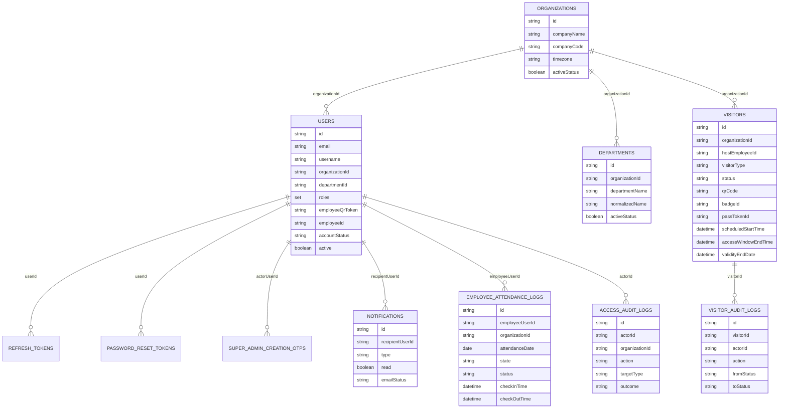

# Database And RBAC

## MongoDB Collections

## Collection Roles

| Collection | Role in system |
| --- | --- |
| `users` | internal accounts, visitor accounts, organization context, employee QR credentials |
| `organizations` | tenant root records |
| `departments` | tenant-scoped department directory |
| `visitors` | visitor lifecycle, scheduling, QR, pass, recurring settings |
| `employee_attendance_logs` | workforce presence trail |
| `notifications` | in-app and email notification queue |
| `access_audit_logs` | platform and organization security audit log |
| `visitor_audit_logs` | visitor lifecycle audit trail |
| `refresh_tokens` | refresh-token rotation storage |
| `password_reset_tokens` | password reset OTP and reset token chain |
| `super_admin_creation_otps` | OTP-confirmed platform-owner creation flow |
| `homepage_settings` | super-admin controlled public homepage visibility |

## Important Indexes

### Entity-level indexes

| Collection | Indexes visible in entity annotations |
| --- | --- |
| `users` | unique `email`, unique sparse `username`, sparse `employeeId`, unique sparse `employeeQrToken`, `organizationId`, `organizationCode` |
| `visitors` | `fullName`, `phone`, `email`, `companyName`, `organizationId`, `visitorType`, `hostEmployeeId`, `hostEmployee`, `department`, `validityStartDate`, `validityEndDate`, `scheduledStartTime`, `scheduledEndTime`, `accessWindowStartTime`, `accessWindowEndTime`, `approvalExpiresAt`, `status`, unique sparse `qrCode`, unique sparse `badgeId`, unique sparse `passTokenId`, `createdAt` |
| `departments` | compound unique `organizationId + normalizedName` |
| `employee_attendance_logs` | `employeeUserId`, `organizationId`, `attendanceDate` |
| `notifications` | `recipientUserId`, `type`, `read`, `createdAt` |
| `access_audit_logs` | `actorId`, `organizationId` |
| `visitor_audit_logs` | `visitorId`, `actorId` |
| `password_reset_tokens` | `userId`, `otpHash`, unique sparse `tokenHash`, unique sparse `resetTokenHash` |
| `refresh_tokens` | `userId`, unique `tokenHash` |

### Startup indexes from `MongoIndexConfig`

| Name | Purpose |
| --- | --- |
| `visitor_host_status_created_idx` | host approval queues |
| `visitor_status_checkin_idx` | check-in status lookups |
| `visitor_org_status_created_idx` | tenant-scoped visitor dashboards |
| `visitor_org_type_validity_idx` | recurring visitor validity scans |
| `visitor_org_status_checkout_idx` | checkout reporting |
| `notification_recipient_read_created_idx` | notification popover reads |
| `audit_visitor_created_idx` | visitor audit history |
| `access_audit_action_created_idx` | audit oversight reporting |
| `employee_attendance_org_date_state_idx` | daily workforce presence queries |
| `employee_attendance_employee_checkin_idx` | employee presence history |
| `super_admin_creation_otp_ttl_idx` | automatic OTP document expiry |

## Visitor Lifecycle State Rules

| State | Meaning | Key transitions |
| --- | --- | --- |
| `PENDING` | waiting for host/admin decision | approve, reject, auto-expire |
| `APPROVED` | approved and pass-ready | check-in, expire, suspend |
| `REJECTED` | denied | terminal for that request |
| `CHECKED_IN` | currently on site | check-out, auto-expire |
| `CHECKED_OUT` | departed | recurring visitors may re-enter later |
| `EXPIRED` | pass or approval no longer valid | recurring may be reactivated only if still within validity |
| `SUSPENDED` | recurring profile blocked | recurring reactivation only |

## Workforce Account State Rules

| Account status | Meaning |
| --- | --- |
| `ACTIVE` | usable internal account |
| `PENDING_APPROVAL` | security-submitted workforce request awaiting admin approval |
| `REJECTED` | workforce onboarding rejected |
| `DISABLED` | internal account disabled |
| `LOCKED` | enum exists but current flows do not actively assign it |

## RBAC Matrix

| Role | Main portal | Allowed actions | Hidden or unavailable UI | Backend enforcement |
| --- | --- | --- | --- | --- |
| `SUPER_ADMIN` | `/admin/*` | platform-wide analytics, org CRUD, homepage settings, monitoring, create admins, create super admins via OTP flow, audit visibility, visitor access | none of the super-admin admin routes are hidden | `hasRole('SUPER_ADMIN')`, `hasAnyRole('SUPER_ADMIN','ADMIN')`, service checks |
| `ADMIN` | `/admin/*` | own-org analytics, user management except admin/super-admin elevation, departments, workforce approval, visitor access, reports | organizations, homepage controls, platform monitoring | route rules plus `AdminUserService`, `DepartmentService`, `WorkforceOnboardingService` |
| `SECURITY_GUARD` | `/security` | queue, QR verification, QR check-in, manual override check-in, visitor registration, recurring visitor control, workforce onboarding intake, employee attendance scan | admin and employee workspaces | `/api/v1/security/**`, visitor org access checks, employee same-org checks |
| `EMPLOYEE` | `/employee` | approve/reject visitor requests, pre-approve visitors, host-side reschedule, own attendance, own badge, create host-owned visitors | security and admin flows | `/api/v1/employee/**`, `requireHostAccess()` |
| `VISITOR` | `/pages/visitor/index.html` | request visit, open approved badge, view history, request reschedule | internal portals and organization management | `/api/v1/visitor/**`, email/org matching in `VisitorService` |

## UI Visibility Rules

Current frontend visibility rules:

- `requireRole("ADMIN")` allows `SUPER_ADMIN` because `roleGuard.js` treats `SUPER_ADMIN` as effective `ADMIN`.
- admin route list is reduced for non-super-admin users.
- employee, security, and visitor shells expose only their own navigation.
- login audience copy changes per role, and post-login redirect is role-driven.

## Backend Isolation Rules Worth Noting

- A security guard can only process employees and visitors in the same organization unless the actor is `SUPER_ADMIN`.
- A host employee can only approve or mutate visitors tied to `hostEmployeeId`.
- Visitors can only access visit records that match their account email and, when present, organization.
- Admins cannot create or assign `SUPER_ADMIN` through normal user management.
