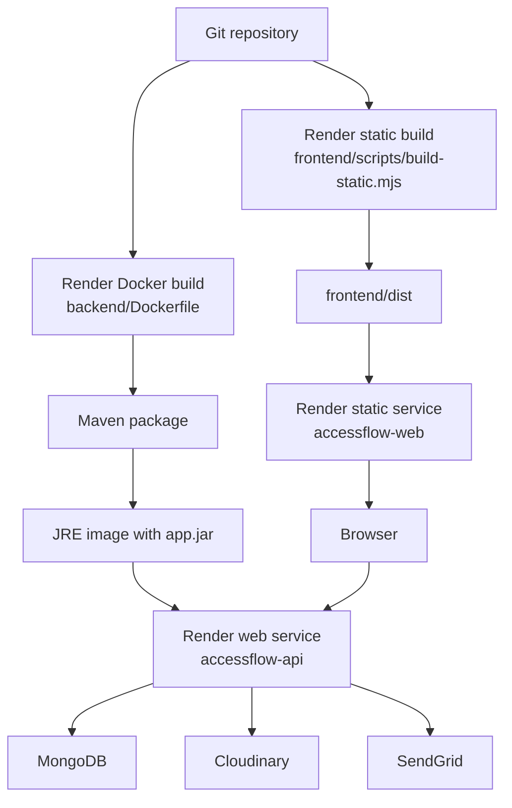
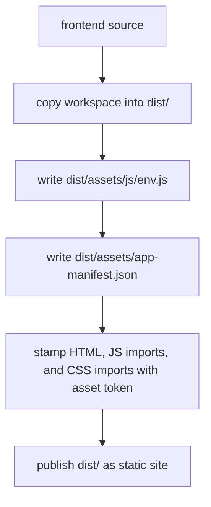
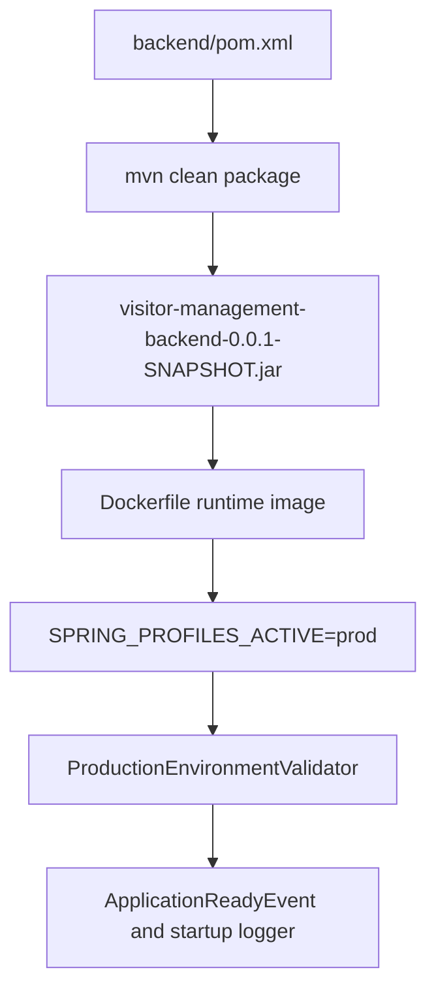
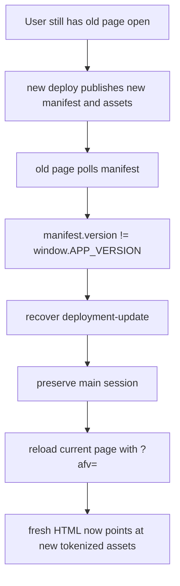

# Deployment And Versioning

## Render Deployment Flow

## Frontend Deployment Lifecycle

Current build metadata fields:

- `window.APP_VERSION`
- `window.APP_ASSET_TOKEN`
- `window.APP_BUILD_TIMESTAMP`
- `window.APP_BUILD_REVISION`

## Backend Deployment Lifecycle

## Runtime Versioning Strategy

The current frontend versioning system combines build-time stamping and runtime polling.

### Build-time controls

- every local HTML `src` and `href` to JS/CSS gets `?v=<assetToken>`
- every relative JS module import gets the same version token
- every local CSS import gets the same version token
- `assets/app-manifest.json` exposes deploy metadata

### Runtime controls

- `boot.js` stores the current version in localStorage
- if the stored version differs from the running version, recovery is triggered
- the app polls the manifest every 60 seconds while visible
- focus and `pageshow` also trigger version re-checks

## Cache Strategy

Current cache headers from `render.yaml`:

| Path group | Cache policy |
| --- | --- |
| `/`, `/index.html`, role pages, auth pages, pass pages | `no-store` |
| `assets/app-manifest.json` | `no-store` |
| `assets/js/env.js` | `no-store` |
| `assets/js/boot.js` | immutable, long-lived |
| `/css/*` | immutable, long-lived |
| `/js/*` | immutable, long-lived |

This design keeps HTML and manifest fresh while allowing aggressively cached versioned assets.

## Safe Refresh And Stale Cache Recovery

## Stale Session Recovery

The deployment recovery path is separate from the auth recovery path.

### Deployment mismatch

- preserve session where possible
- clear transient `accessflow.*` state
- hard reload current page

### Invalid auth state

- clear session
- show runtime notice
- redirect to `/`

## Backend Production Guardrails

`ProductionEnvironmentValidator` blocks or degrades startup based on environment state.

Hard requirements:

- `MONGODB_URI`
- `JWT_SECRET`
- `FRONTEND_PUBLIC_URL`
- `CORS_ALLOWED_ORIGINS`
- non-local production MongoDB Atlas URI
- non-placeholder JWT secret
- secure non-wildcard public origin

Optional but degraded when missing:

- Cloudinary credentials
- SendGrid API key
- verified SendGrid sender

## Current Runtime Integrations

| Integration | Runtime use |
| --- | --- |
| MongoDB | persistent data store |
| Cloudinary | visitor/workforce photo uploads |
| SendGrid | password reset OTP and notification email |
| Render static site | frontend hosting |
| Render Docker web service | backend hosting |

## Deployment-Specific Files

- `render.yaml`
- `frontend/scripts/build-static.mjs`
- `frontend/assets/js/boot.js`
- `frontend/assets/js/env.js`
- `backend/Dockerfile`
- `backend/src/main/resources/application-prod.yml`
- `backend/src/main/java/com/visitor/management/config/ProductionEnvironmentValidator.java`
