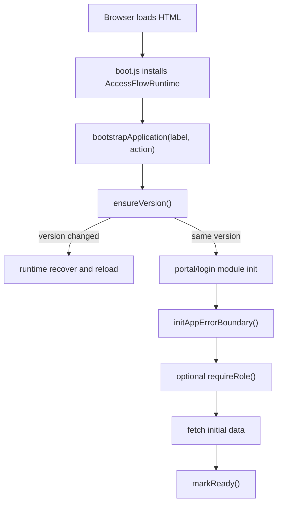
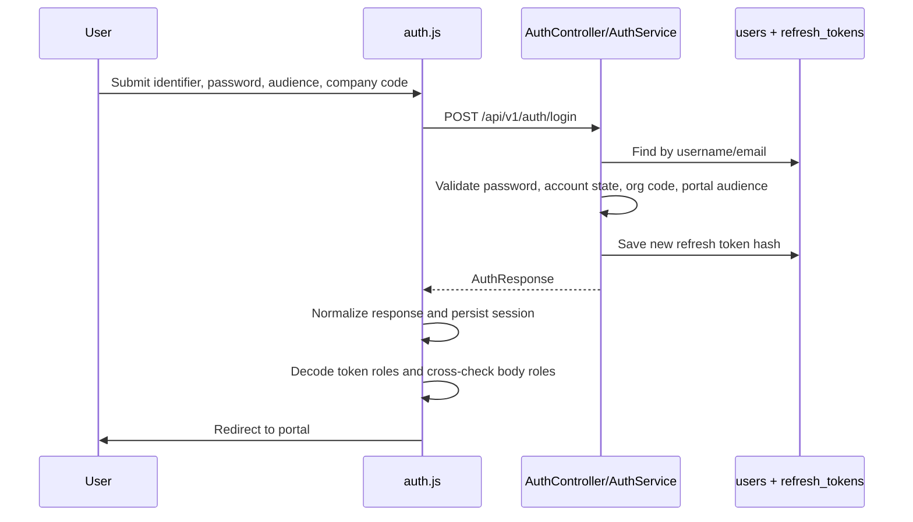
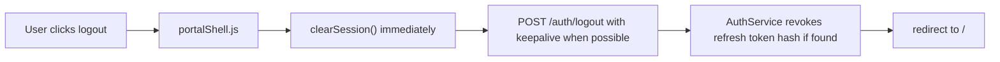
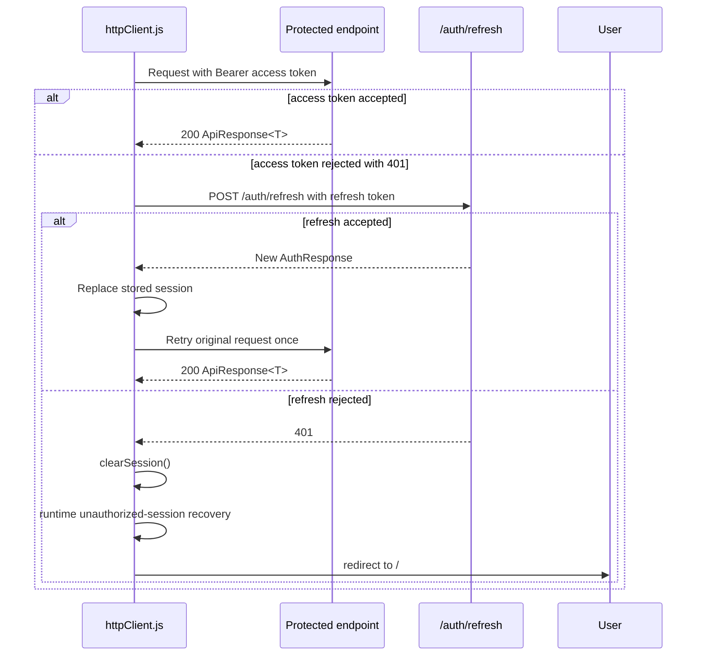
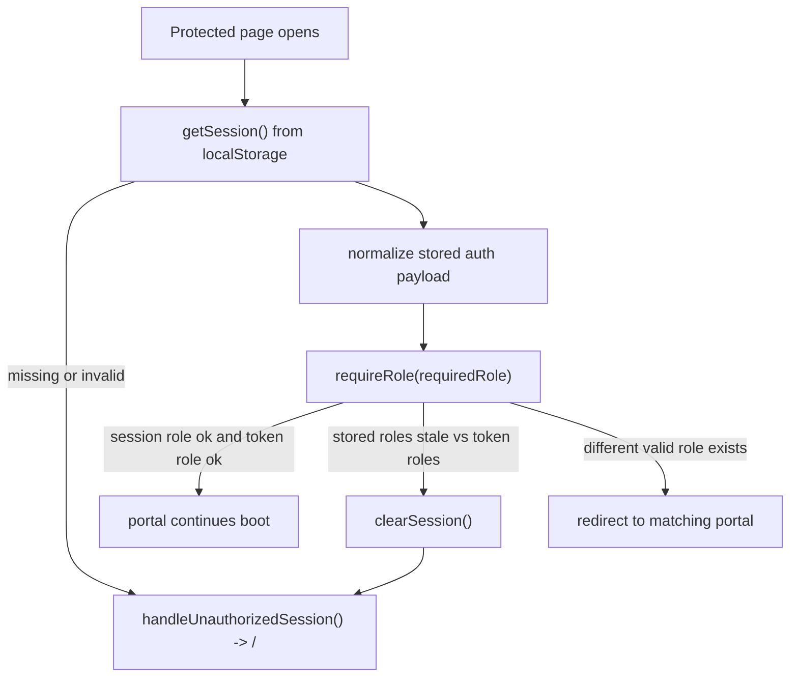
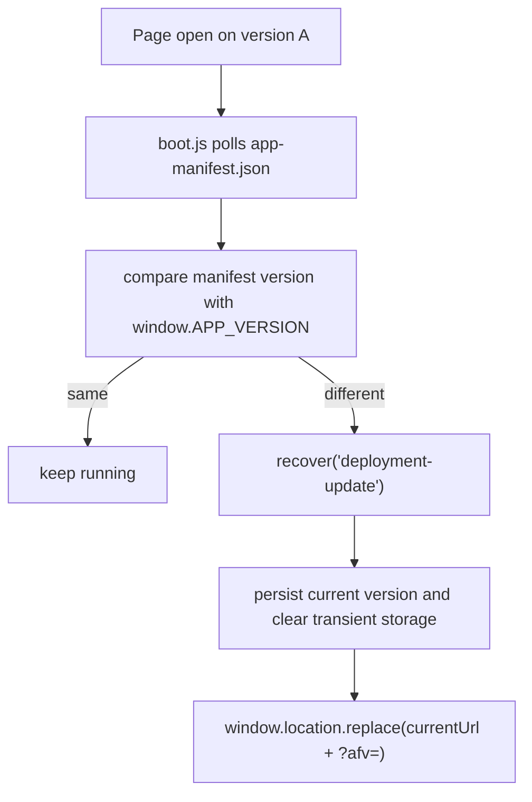
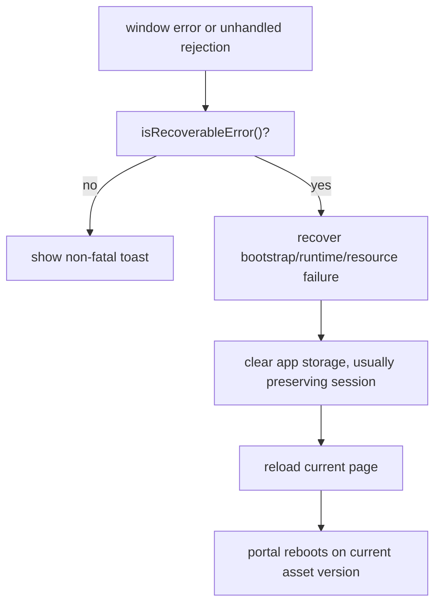
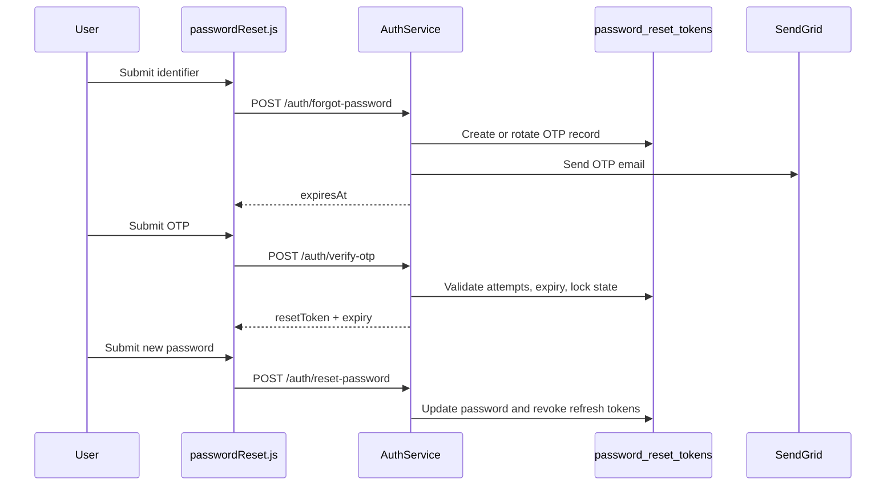

# Auth And Runtime Flows

## App Bootstrap Flow

## Login Flow

## Logout Flow

## Access Token Handling And Refresh

## Session Restore Flow

## Stale Session Recovery

The current frontend treats a session as stale when:

- the stored session has a role but the decoded JWT claims no longer overlap
- a protected request returns `401` and refresh cannot repair it
- runtime recovery is told to handle `"stale-session"` or `"invalid-session"`

Outcome:

- localStorage session is cleared
- most `accessflow.*` state is cleared
- user is redirected to `/`
- the login screen becomes the only re-entry point

## Frontend Version Mismatch Recovery

## Asset And Module Failure Recovery

## Safe Refresh Handling

The shared refresh button in `portalShell.js` does two things:

- checks `/api/v1/health`
- optionally calls a portal-specific data reload callback

It does not bypass the runtime system or skip auth rules. It is a safe data reload, not a hard runtime reset.

## Password Recovery Flow

## Current Auth Rules

- Visitors can log in without company code.
- Internal accounts require company code unless the account is `SUPER_ADMIN`.
- Portal audience is enforced at login time.
- Password changes invalidate previously issued access tokens indirectly because `JwtAuthenticationFilter` rejects tokens issued before `passwordChangedAt`.
