# Visitor, Workforce, And Security Flows

## Visitor Lifecycle States

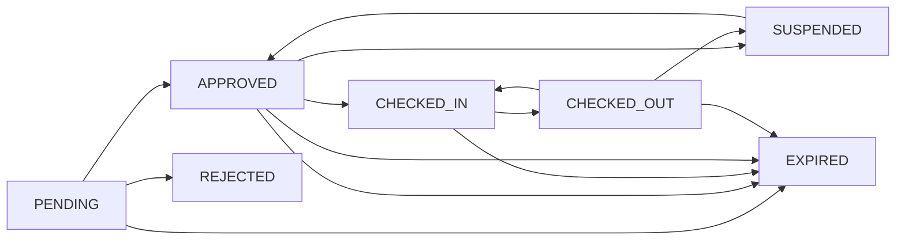

Notes:

- `CHECKED_OUT -> CHECKED_IN` is allowed only for recurring visitor profiles.
- `SUSPENDED` and recurring reactivation are recurring-profile only.
- `EXPIRED` can mean pending approval timeout, scheduled pass expiry, or recurring validity expiry.

## Self-Service Visitor Flow

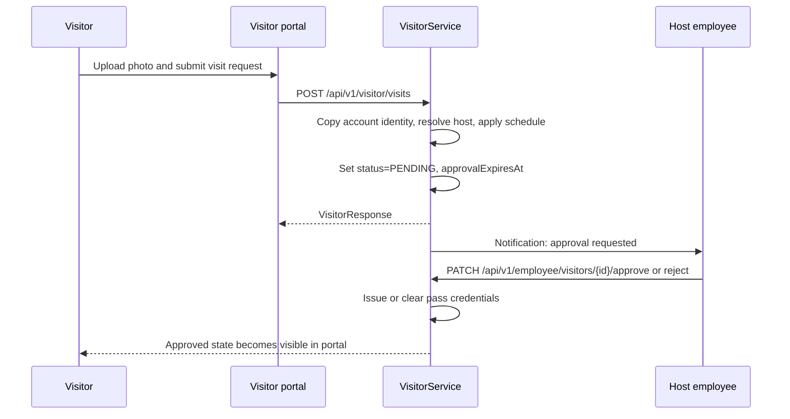

## Pre-Approved Visitor Flow

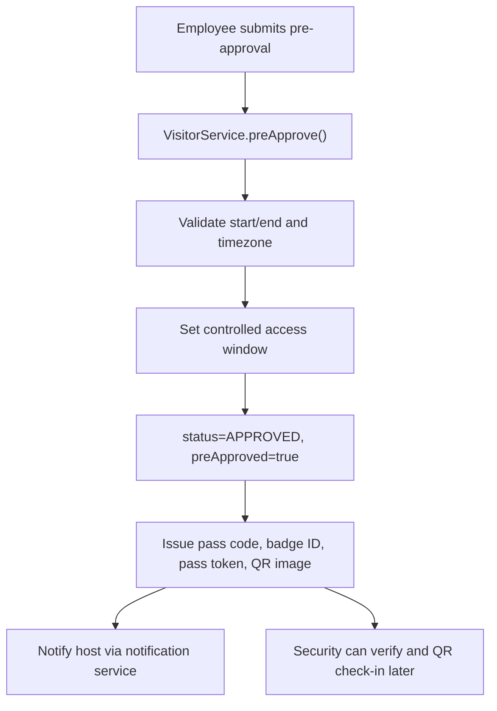

Current behavior:

- pre-approved visitors must be checked in by QR scan or manual override
- ordinary direct `check-in` without QR is blocked for `preApproved=true`

## Walk-In And Emergency Flow

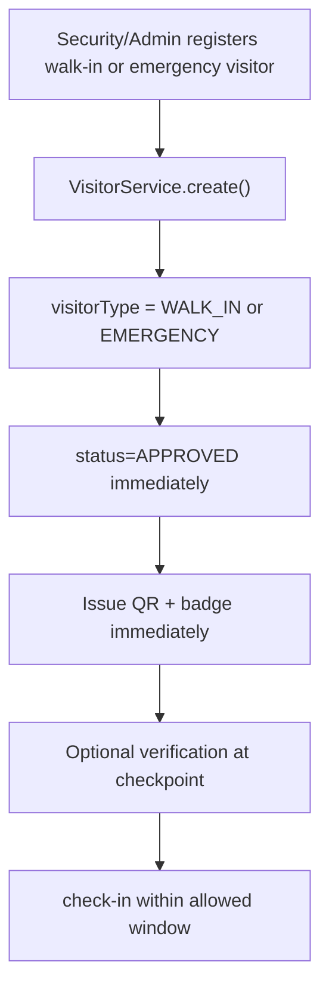

## Recurring Visitor Flow

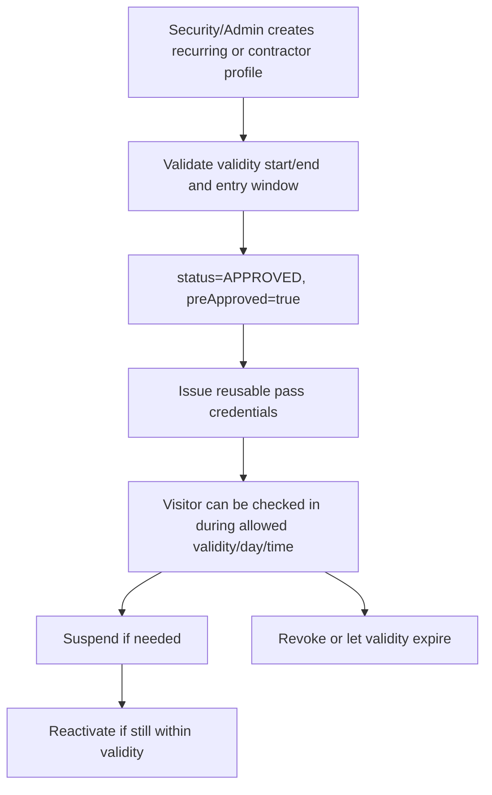

Current recurring rules:

- only security, admin, or super admin can create recurring profiles
- allowed weekdays are normalized to `MON` through `SUN`
- entry-window start/end must either both exist or both be absent
- reactivation fails if `validityEndDate` has already passed

## Visitor Approval And Rejection Flow

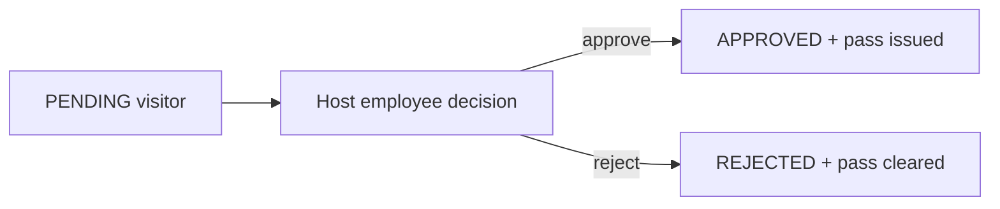

## Visitor Reschedule Flow

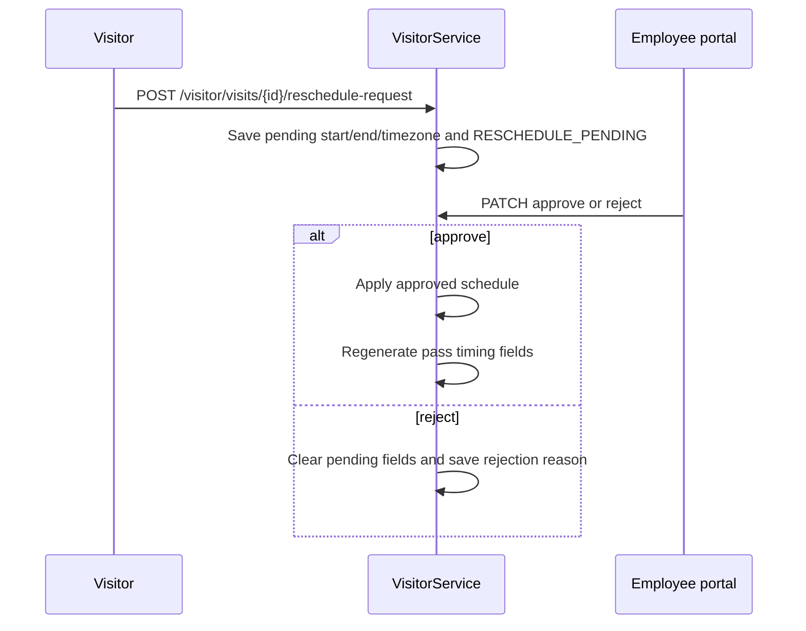

Host-side direct reschedule also exists through:

- `PATCH /api/v1/employee/visitors/{id}/reschedule`

## Visitor QR Generation

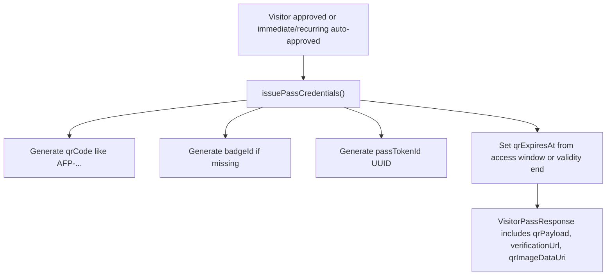

## Visitor QR Validation Flow

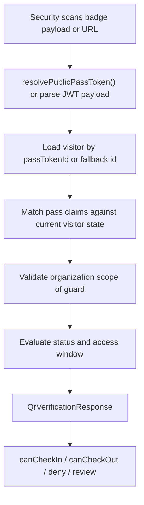

Current invalid or blocked conditions:

- organization mismatch
- pending approval
- rejected visitor
- suspended recurring visitor
- expired pass
- already used pass
- already checked-in visitor
- recurring visitor outside weekday or entry window

## QR Expiry Flow

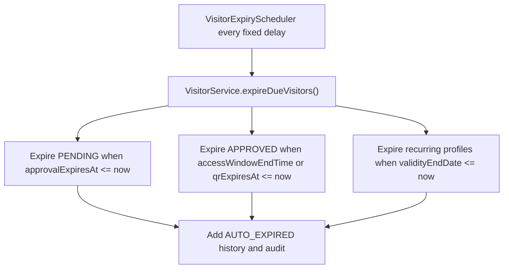

## Workforce / Employee Onboarding Flow

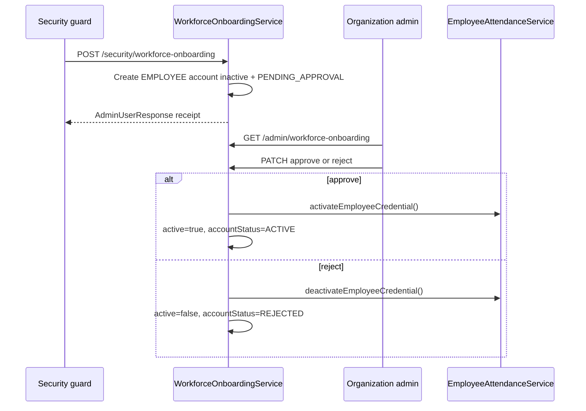

## Static Employee QR Activation Flow

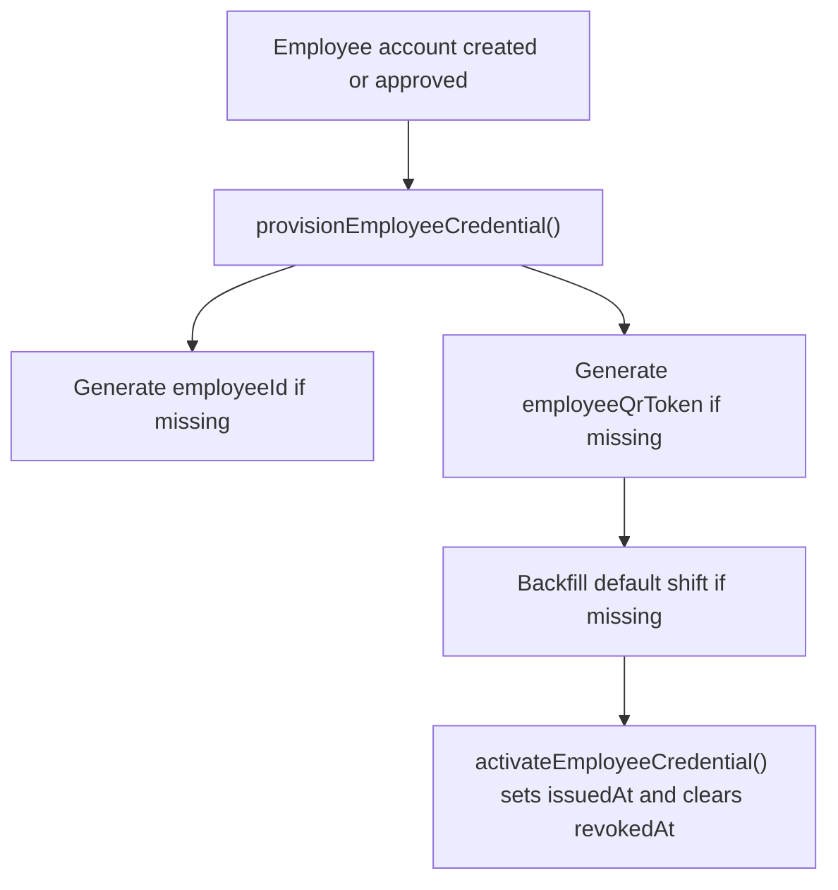

Current activation triggers:

- internal employee account creation by admin
- workforce onboarding approval
- employee account re-enable

Current deactivation triggers:

- workforce rejection
- employee account disable

## Employee Check-In / Check-Out Flow

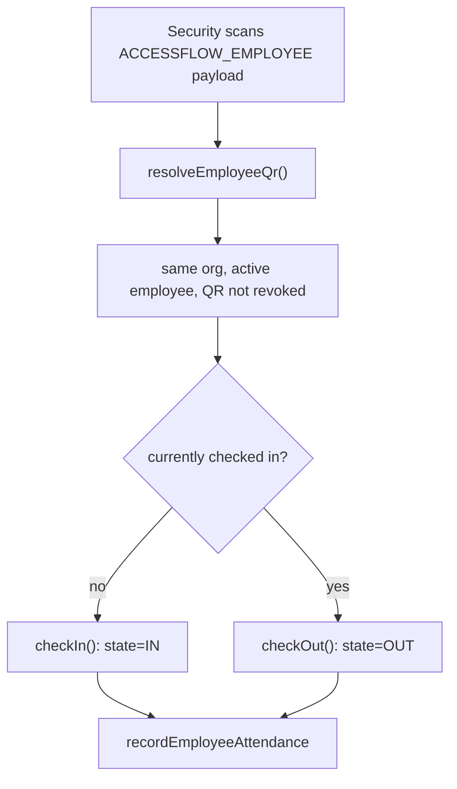

## Manual Workforce Override Flow

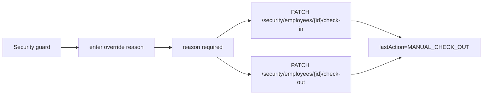

## Security Checkpoint Flow

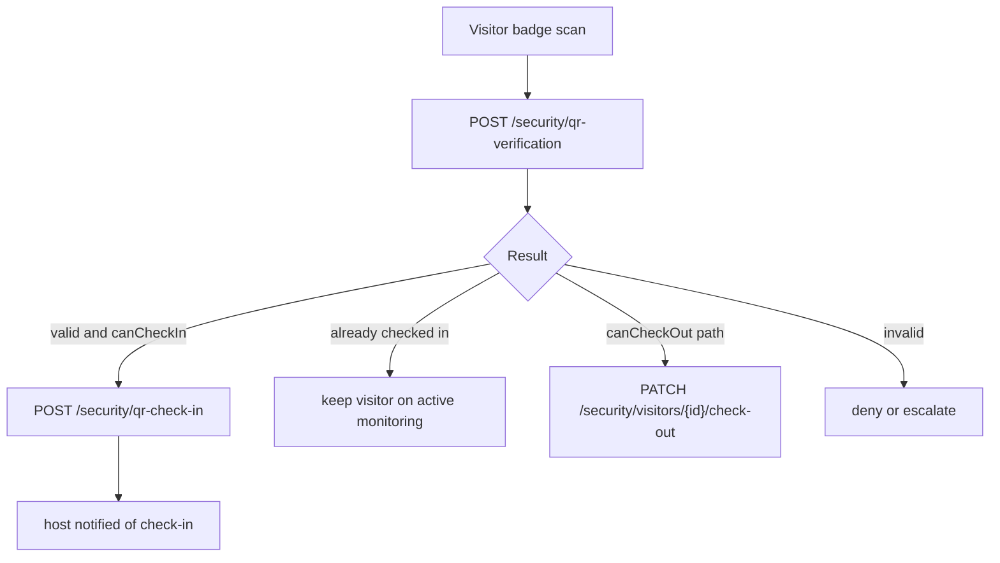

## Admin Flow

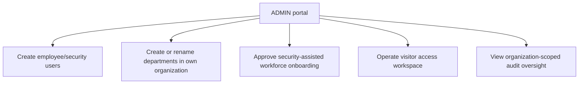

## Super Admin Flow

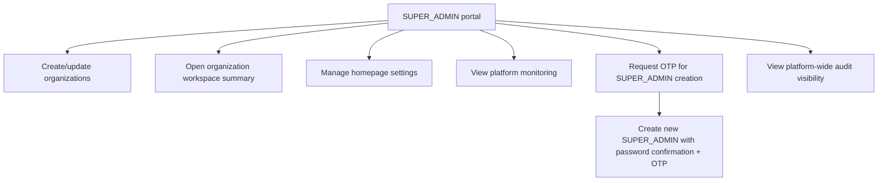
