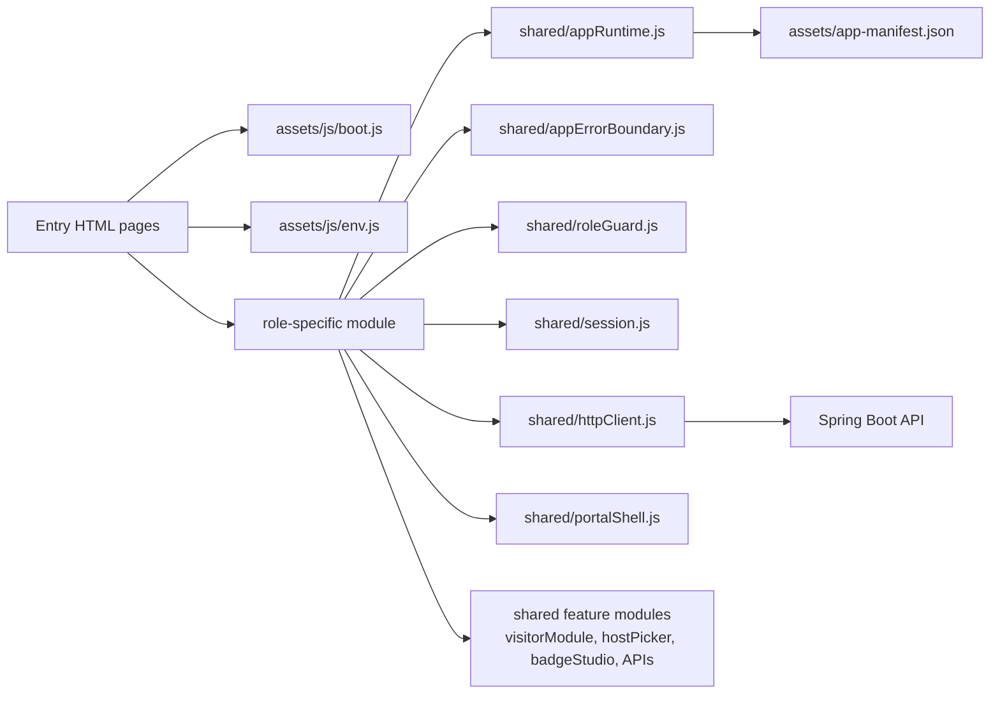

# Frontend Architecture

## Frontend Model

The frontend is not a single JavaScript SPA in the React/Vue sense. It is a static multi-entry application:

- `frontend/index.html` is the public landing page and auth hub.
- `frontend/pages/admin/index.html` is the admin shell.
- `frontend/pages/employee/index.html` is the employee shell.
- `frontend/pages/security/index.html` is the security shell.
- `frontend/pages/visitor/index.html` is the visitor shell.
- `frontend/pages/pass/index.html` is the public badge verification page.
- `frontend/pages/forgot-password`, `verify-otp`, and `reset-password` are standalone recovery pages.

Shared behavior is centralized in `frontend/js/shared/`, and each portal has its own dashboard module under `frontend/js/{role}/dashboard.js`.

## Frontend Module Diagram

## Routing

## Public Entry Points

| Route | Render target | JS entry | Notes |
| --- | --- | --- | --- |
| `/` | `frontend/index.html` | `frontend/js/auth.js` | Login, register, homepage metrics |
| `/forgot-password` | `frontend/pages/forgot-password/index.html` | `frontend/js/passwordReset.js` | Starts password reset |
| `/verify-otp` | `frontend/pages/verify-otp/index.html` | `frontend/js/passwordReset.js` | OTP verification |
| `/reset-password` | `frontend/pages/reset-password/index.html` | `frontend/js/passwordReset.js` | New password form |
| `/pass/*` and `/verify/*` | `frontend/pages/pass/index.html` | `frontend/js/pass/verify.js` | Public pass verification |

## Portal Entry Points

| Route | HTML shell | Routing style | Driver |
| --- | --- | --- | --- |
| `/admin/*` | `pages/admin/index.html` | Path-based workspace routing | `js/admin/dashboard.js` |
| `/employee` | `pages/employee/index.html` | Hash routing between sections | `js/employee/dashboard.js` |
| `/security` | `pages/security/index.html` | Hash routing between sections | `js/security/dashboard.js` |
| `/pages/visitor/index.html` | `pages/visitor/index.html` | Hash routing between sections | `js/visitor/dashboard.js` |

### Important admin routing detail

Admin uses path routing, not hash routing, in the current production setup:

- `/admin/analytics`
- `/admin/users`
- `/admin/departments`
- `/admin/organizations`
- `/admin/homepage-controls`
- `/admin/reports`
- `/admin/monitoring`
- `/admin/visitor-access`
- `/admin/workforce-approvals`

`frontend/js/admin/dashboard.js` normalizes the current path, maps aliases, and decides whether to load the route or redirect to the first allowed route.

## Dashboard Lifecycle

### Shared pattern

Each protected portal follows the same startup chain:

1. `bootstrapApplication()` registers the runtime label and checks version state.
2. `initAppErrorBoundary()` installs global runtime failure handling.
3. `requireRole()` restores the stored session and validates the role against token claims.
4. `initPortalShell()` sets sidebar, topbar, logout, notifications, health, and refresh behavior.
5. Portal-specific modules initialize.
6. Initial data loads are triggered with parallel API calls.

### Employee portal

- Loads overview, notifications, scheduled visitors, own attendance, own badge, and approvals.
- Uses `initVisitorModule()` for employee-owned visitor history and creation.
- Polls approvals every 15 seconds.

### Security portal

- Loads overview, queue, monitoring, photo-capture metadata, employee search, and workforce logs.
- Uses `initVisitorModule()` with recurring-visitor fields enabled.
- Supports QR verification, camera scan, badge printing, workforce onboarding, and employee QR scan.
- Refreshes live data every 15 seconds.

### Visitor portal

- Loads overview, current visits, and history.
- Initializes organization select and host picker.
- Lets visitors upload a photo, request a visit, request a reschedule, and open an approved badge.

### Admin portal

- Uses a single workspace shell and swaps route content inside `#workspace-view`.
- Allowed routes depend on the stored session roles:
  - `SUPER_ADMIN` sees organizations, homepage controls, and monitoring.
  - `ADMIN` does not.

## Auth And Session Lifecycle

`frontend/js/shared/session.js` stores one localStorage record:

- key: `visitor_management_session`
- shape: `{ schemaVersion, appVersion, persistedAt, session }`

The normalized session contains:

- `accessToken`
- `refreshToken`
- user identity fields
- organization fields
- normalized roles

`roleGuard.js` then enforces portal access by checking:

- session presence
- access and refresh token presence
- required role in stored session
- overlap between stored roles and JWT roles

If session roles and token roles diverge, the frontend treats that as a stale session and clears storage.

## Token Refresh And Unauthorized Recovery

`httpClient.js` owns authenticated fetch behavior:

1. Attach `Authorization: Bearer <accessToken>` when `auth !== false`.
2. On `401`, call `/auth/refresh` once using the stored refresh token.
3. If refresh succeeds, store the new session and retry the original request once.
4. If refresh fails, clear the session and hand control to runtime recovery, which redirects to `/`.

## Sidebar And Navigation System

`portalShell.js` is the shared portal shell layer.

Responsibilities:

- desktop collapse state persisted in `sessionStorage`
- mobile open/close state
- route link highlighting
- topbar refresh button
- logout with `keepalive` logout request
- notification popover
- backend health check widget

Organization-scoped sidebar state is stored under keys like:

- `accessflow.sidebar:<scope>`

## Runtime Recovery And Module Loading

Version and recovery behavior is spread across:

- `frontend/assets/js/boot.js`
- `frontend/js/shared/appRuntime.js`
- `frontend/js/shared/appErrorBoundary.js`

Current runtime protections:

- store the current app version in localStorage
- poll `assets/app-manifest.json` every 60 seconds when visible
- trigger recovery when stored version differs from current version
- catch stale dynamic module errors and failed asset loads
- clear `accessflow.*` storage on recovery
- optionally preserve the main session during deployment refresh
- redirect to login for unauthorized or invalid sessions

## Cache And Versioning Architecture

The frontend build is handled by `frontend/scripts/build-static.mjs`.

Current build behavior:

- copies the workspace into `frontend/dist/`
- writes a deploy-specific `assets/js/env.js`
- creates `assets/app-manifest.json`
- stamps local HTML asset references with `?v=<assetToken>`
- rewrites local JS import specifiers with the same token
- rewrites CSS imports with the same token

This gives the runtime two layers of protection:

- immutable asset URLs by version token
- manifest-based detection of a newer deployment while a user still has an older page open

## Responsive And Device Strategy

The current implementation supports three main device modes.

### Desktop

- Admin is desktop-first and path-routed.
- Employee and security dashboards assume broader layouts with sidebar and multi-panel cards.
- Badge print and export workflows are designed for larger screens and printers.

### Mobile

- Visitor request flow works on mobile and uses `<input type="file" capture="user">` for visitor photos.
- Portal shell collapses to a mobile sidebar state with backdrop support.
- Runtime recovery notices and refresh actions are rendered as fixed overlays.

### Tablet / front desk

- Security flows are tablet-friendly:
  - QR input field for hardware scanners
  - camera-scan fallback
  - workforce onboarding form
  - badge preview modals
- Employee QR scanning also supports either pasted hardware input or camera scan.

### QR scanning UX

- Visitor verification accepts either:
  - a public badge URL
  - a pass token
  - a legacy JWT-like QR payload
- Employee attendance accepts only the employee static QR payload format.

## Frontend Recovery Boundaries

The frontend intentionally treats these as recoverable states:

- failed script or stylesheet load
- stale dynamic module error
- deployment version mismatch
- session/token mismatch
- unauthorized protected request after failed refresh

The goal of the current implementation is to prefer refresh-and-restore behavior over leaving a partially updated portal running.
