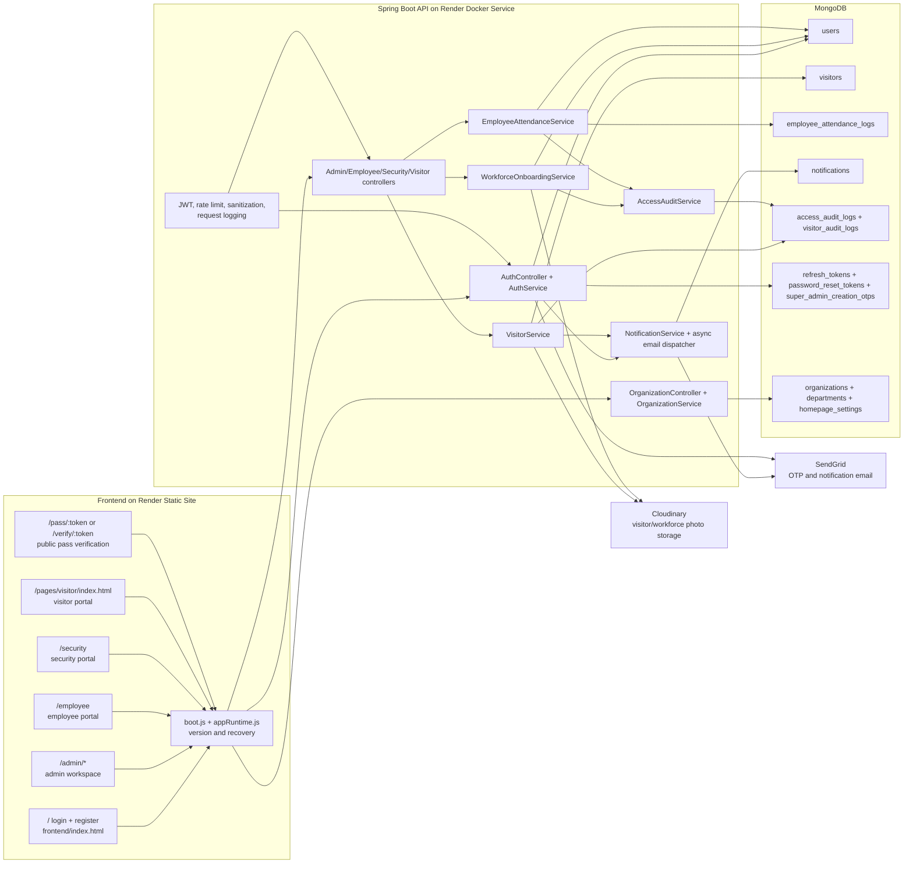
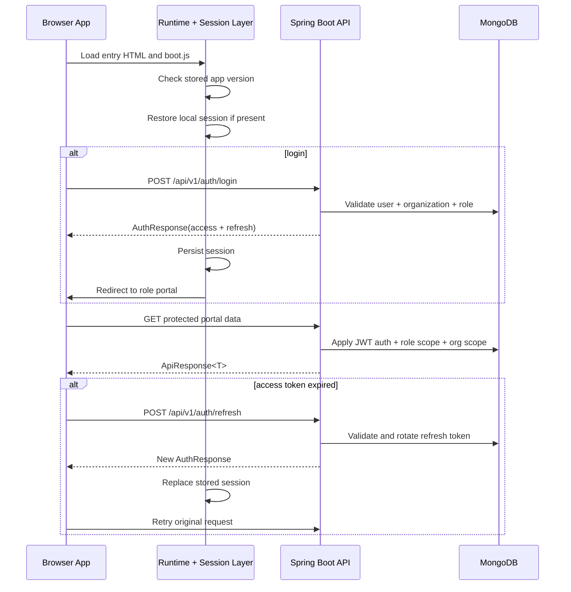
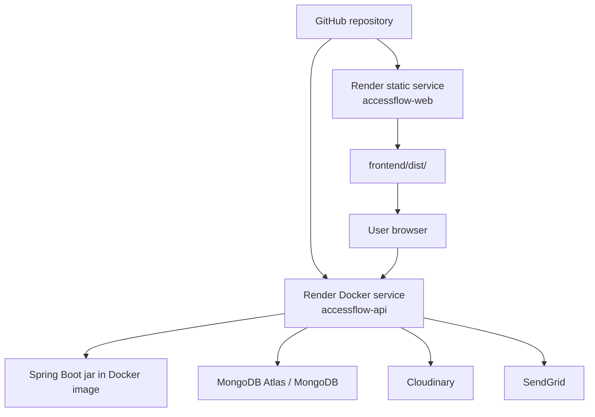
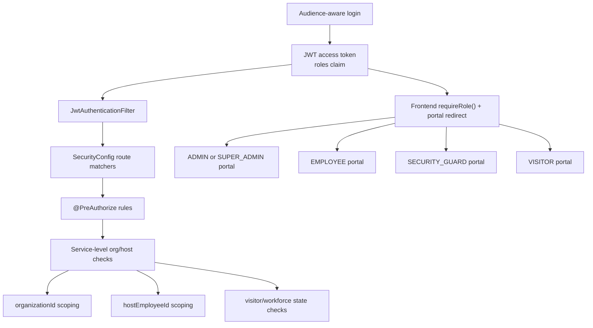

# System Overview

## Architecture Summary

AccessFlow is a role-based visitor and workforce access system with a static frontend and a Spring Boot API. The frontend is split into a public landing/auth shell, role-specific portals, and a public badge verification page. The backend owns all business rules for organization scoping, approvals, QR issuance, workforce activation, audit logging, and runtime security.

## System Architecture

## Frontend To Backend Interaction

## Deployment Architecture

## RBAC Architecture

## Key Implementation Facts

- Visitor QR verification is not a frontend-only concern. The browser always asks the backend to verify live approval, timing, organization, and lifecycle state.
- Workforce static QR payloads are separate from visitor passes and are interpreted only by `EmployeeAttendanceService`.
- Organization isolation is enforced mostly in services, not just in route annotations.
- Notification email sending is asynchronous and retry-based.
- Cache-based analytics exist on the backend through the `adminAnalytics` and `statusSummary` caches.
